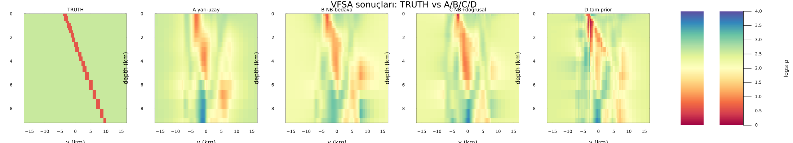

# SmartPriorMT

2B manyetotellürik (MT) ters çözümü için, homojen yarı-uzay başlangıcı
yerine, gravite + topografya + MT'nin kendi Niblett-Bostick dönüşümünden
hücre-bazlı bir başlangıç modeli (μ, σ) üretir. Bu model VFSA çözücüsüne
warm-start olarak verilir.

**Bu bir joint inversion DEĞİLDİR.** Füzyon yalnızca prior üretim
aşamasında olur; VFSA çözücüsüne dokunulmaz.

### Kurulum

Julia 1.10 veya üzeri gerekir. Depoyu klonladıktan sonra paket ortamını
kurun:

```julia
using Pkg
Pkg.activate(".")
Pkg.instantiate()
```

Başka bir Julia projesinden yerel yolu eklemek için:

```julia
using Pkg
Pkg.add(path="path/to/SmartPriorModel")
```

`Project.toml` bağımlılıkları ve `compat` sınırları:

| Paket | Compat |
|---|---|
| ArchGDAL | 0.10.12 |
| ComponentArrays | 0.15.47 |
| ForwardDiff | 1.4.5 |
| Interpolations | 0.15.1 |
| JLD2 | 0.6.6 |
| Lux | 1.31.4 |
| MTGeophysics | 0.5.0 |
| Optimisers | 0.4.9 |
| Plots | 1.41.7 |
| Zygote | 0.7.12 |
| julia | 1.10 |

Standart kütüphane bağımlılıkları (compat yok): `LinearAlgebra`, `Printf`,
`Random`, `Statistics`.

### Hızlı örnek

`examples/compare_prior_2d.jl` sentetik bir 2B doğrulama koşar. MTGeophysics
ağında eğimli iletken bir slab truth'u kurar; 2B sonlu-hacim çözücüsünden
gürültülü MT gözlemleri ve truth'un (özdirençten bağımsız) yoğunluğundan
gravite üretir. Gravite ve gözlenen MT'nin Niblett-Bostick dönüşümünden,
truth'u hiç görmeden bir smart prior eğitilir. Aynı VFSA ayarları ve seed ile
iki ters çözüm koşulur — biri homojen yarı-uzaydan, biri prior'dan — ve her
ikisi truth'a karşı skorlanır.

```bash
julia --project=. examples/compare_prior_2d.jl
```

Birkaç dakika sürer; sürenin çoğu iki ters çözümde geçer.

### Mimari
FeatureStack (gravite+MT+NB+topografya kanalları) → Lux.jl koordinat-ağı
(residual-mode, NB baseline'a göre öğrenilen düzeltme) → PriorBundle (μ,σ)
→ VFSA warm-start.

### Doğrulama Durumu

**Sentetik (truth bilinir):**
- RMS iter1: yarı-uzay 30.260±0.019, prior 4.558±0.080 (~150 std fark).
  RMS iter400: yarı-uzay 4.995±0.347, prior 3.744±0.340 (artık anlamlı).
  Prior ham RMSE 0.546±0.008 vs NB baseline 0.551±0.005 (çok yakın, kesin
  üstünlük yok, seed'e göre değişiyor). Korelasyon 0.443±0.008 vs NB
  0.428±0.002 (net üstünlük, aralıklar örtüşmüyor). 3 bağımsız zincirle,
  güncel kodla doğrulandı.
- Kalibrasyon: reference=0.1 en dengeli nokta (tek seed).

Ablasyon (`examples/ablation_prior_2d.jl`): aynı sentetik veri ve VFSA
ayarlarıyla dört başlangıç — A yarı-uzay, B NB-bedava, C NB+doğrusal
gravite, D tam prior. Üst satır başlangıç, alt satır VFSA sonucu:


Yalnızca VFSA sonuçları:



**Gerçek veri (Musgrave Province, AusLAMP, Avustralya — truth YOK):**
- Üç bağımsız kalibrasyon hatası bulunup düzeltildi: MT empedans birimi
  (mV/km/nT, SI değil), gravite hata kaynağı (ölçüm hassasiyeti ≠ model
  hatası, %135× fark), MT hata bütçesi (aynı sorun, ~%40 model payı).
- Gravite-direnç eğim işareti (pozitif, Giles Complex) literatürle
  doğrulandı.
- target_rms=1.0 duman testinde (max_iter=100) prior 5-6 iterasyonda
  hedefe ulaştı, yarı-uzay 100 iterasyonda bile ulaşamadı (en iyi
  1.09-1.19). Ayrı bir tam-bütçe koşusunda (target_rms=0.1, max_iter=400,
  erken durma kapalı) ikisi de hedefe ulaşamadı ama prior yine daha düşük
  final RMS'e indi (0.911 vs 1.040).
- ❌ Prior'ın NİHAİ KALİTESİ (yarı-uzaydan daha doğru mu) kanıtlanamadı
  — truth yok, düşük RMS/yüksek pürüzlülük ayırt edilemiyor.

### Bilinen Sınırlamalar
- Tek küresel gravite-özdirenç eğimi → tek baskın litoloji varsayımı.
  Karışık litolojide (Musgrave'de olduğu gibi, dirençli Giles kütleleri +
  iletken fay zonları) zorlanır.
- TE-only (TM incelendi, v0.1.0'a alınmadı; bkz. Açık Sorular / v0.2 Adayları).
- VFSA'nın kendi ileri fiziği düz-datum varsayıyor; surface_z sadece
  prior üretiminde kullanılıyor, VFSA'nın kendisine girmiyor.
- σ hiç veriye fit edilmiyor (anchor mekanizması var ama beslenmiyor).
- Gravite tarafında operatör-düzeyinde ters suç var (bilerek, petrofizik
  bağımsız); MT'de yok.
- `RealDataIO.jl` şu an Musgrave'e özgü (hardcoded); genel bir "kendi
  verini getir" API'sine dönüştürülmedi.
- BoundedVFSA.jl kapsam dışı: 3B için hazırlanmış, hiç kullanılmamış,
  kanıtsız.

### Açık Sorular / v0.2 Adayları

TM verisi mevcut ve faz tensörü skew analiziyle (medyan β=2.9°, %76
<5°) çoğunlukla 2B-uyumlu bulundu, ancak TM'nin model-temsil hatası
TE'nin ~3 katı ve istasyonlar arası çok heterojen (SA348: 2.63 decade
artık, SA347: 0.18 decade) -- SA350/WA44/SA348 tekrarlayan şekilde
sorunlu çıkıyor, muhtemelen gerçek 3B/galvanik distorsiyon sinyali.
Tek bir global model_err_frac ile kalibre edilemez; istasyon-bazlı
inceleme veya bu istasyonların dışlanması gerekir. v0.2 adayı.

Mesh çözünürlüğü test edildi (5km vs 20km) -- kaba ağda (20km) prior,
yarı-uzaydan DAHA KÖTÜ sonuç verdi (best_rms 2.497 vs 2.299) -- doğru
çözünürlük bulunamadı, sistematik tarama gerekiyor (v0.2).

### MTGeophysics.jl İlişkisi
Bağımsız bir ekosistem paketi (MTGeophysics'e bağımlı, kod değişikliği
değil). Ayrı bir upstream PR adayı var (solve_mt1d_analytical'daki
Float64 cast'inin kaldırılması, ForwardDiff uyumluluğu için) — henüz
gönderilmedi.

### Lisans
MIT, bkz. LICENSE.
