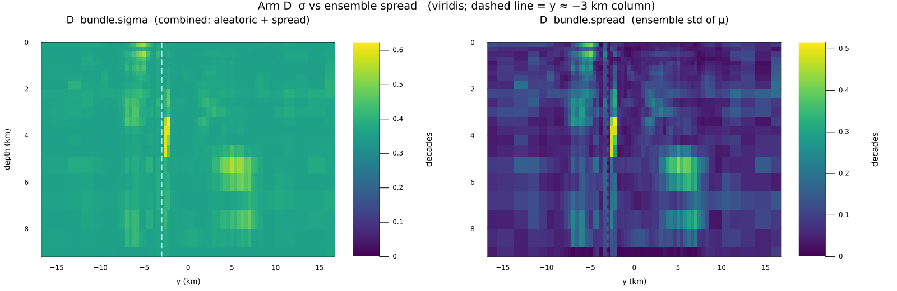

# SmartPriorMT

2B manyetotellürik (MT) ters çözümü için **warm-start prior**. Homojen yarı-uzay
yerine, gravite + gözlenen MT'nin Niblett–Bostick (NB) dönüşümü (+ isteğe bağlı
topoğrafya) ile hücre-bazlı bir nominal log₁₀ ρ (`μ`) ve `σ` üretir; `μ`'yü
VFSA2DMT'ye (2B) başlangıç modeli olarak verir.

**Bu bir joint inversion değildir.** Gravite VFSA χ²'sine girmez; füzyon yalnızca
prior aşamasındadır. Çözücünün ileri fiziği, pertürbasyonu ve soğuma çizelgesi
değiştirilmez. `σ` (`prior.std`, `prior.lo` / `prior.hi`) yazılır ama mevcut
`VFSA2DMT` global `log_bounds` kullanır — hücre-bazlı aralık inversiyona girmez.

Sürüm 0.1.0 · Julia 1.10 · MTGeophysics 0.5.0. Tam tablo, figür ve sunum sırası:
[`docs/ARA_RAPOR.md`](docs/ARA_RAPOR.md).

> **Güncel durum (Eylül 2026):** VFSA arama, mevcut varsayılan bütçede
> (`max_iter=400`) hedef veri uyumuna (RMS=1.0) ulaşmıyor. Bütçe artışının
> etkisi test ediliyor — bkz. [VFSA Yakınsama Bütçesi](#vfsa-yakınsama-bütçesi-güncel-deneme).
> Bu, prior'ın kendisiyle ilgili bir bulgu değil, arama tarafının ayrı bir
> açık konusudur.

## Kurulum

```julia
using Pkg
Pkg.activate(".")
Pkg.instantiate()
```

Yerel yol:

```julia
Pkg.add(path="path/to/SmartPriorModel")
```

| Paket | Compat |
|---|---|
| ArchGDAL | 0.10.12 |
| ComponentArrays | 0.15.47 |
| ForwardDiff | 1.4.5 |
| Interpolations | 0.15.1 |
| JLD2 | 0.6.6 |
| Lux | 1.31.4 |
| MTGeophysics | 0.5.0 |
| Optimisers | 0.4.9 |
| Plots | 1.41.7 |
| Zygote | 0.7.12 |
| julia | 1.10 |

Stdlib (compat yok): `LinearAlgebra`, `Printf`, `Random`, `Statistics`.

## Hızlı örnek

```bash
julia --project=. examples/compare_prior_2d.jl
```

Sentetik eğimli iletken slab; 2B sonlu-hacim MT + bağımsız yoğunluktan gravite.
Prior truth'u görmez. Aynı VFSA ayarı ve seed ile iki koşu: yarı-uzay vs prior.
Sürenin çoğu inversiyonda geçer.

Ablasyon (A yarı-uzay, B NB, C NB+doğrusal gravite, D tam prior):

```bash
julia --project=. examples/ablation_prior_2d.jl
```

İsteğe bağlı derinlik-duyarlı gravite kanalı (varsayılan kapalı; geriye uyumlu):

```bash
SMARTPRIOR_GRAVITY_SENSITIVITY=true julia --project=. examples/ablation_prior_2d.jl
```

Truth-bağımsız hiperparametre (eğitim only, VFSA yok):

```bash
SMARTPRIOR_PROTOCOL=blind SMARTPRIOR_WORK=tmp_blind_t1 \
  julia --project=. examples/train_prior_blind.jl
```

Jeoloji sweep'i (eğim açısı + kontrast işareti, VFSA yok — bkz.
[`docs/ARA_RAPOR.md` §10](docs/ARA_RAPOR.md#10-genelleştirme-planı-sıradaki-adımlar)):

```bash
julia --project=. examples/scenario_sweep_prior_2d.jl
```

## Mimari

```
FeatureStack → Lux koordinat-ağı (NB'ye residual) → PriorBundle (μ, σ)
            → start_prior.rho → VFSA2DMT
```

2B özellikler: 3 koordinat + 2 derinlik + 7 gravite + 0 topo + 1 coverage +
1 baseline = 14 kanal. `x_norm` ve `gravity_dx` tanım gereği sıfır → **efektif 12**.
"14 kanal" demek yanıltıcıdır. Sentetik yolda topo kanalı yok; Musgrave DEM'i
`surface_z` olarak verir. VFSA ileri çözümü düz-datum varsayar.

Mevcut 7 gravite kanalı yüzey haritasının her kata sönümsüz kopyasıdır (extrude;
derinlik körü). `build_features(...; gravity_sensitivity=false)` varsayılanı bunu
korur. `true` iken bir ek kanal eklenir — aşağıda.

Kayıp etiketsiz ve AD-güvenli: prizma gravite, 1B MT kolon, pürüzlülük, `σ`
hedefi (`SigmaDriveConfig`; likelihood değil). `slope` işareti dışsal varsayım
(sentetikte yoğun=iletken); büyüklük kör protokolde geniş tutucu bant.

VFSA arama, prior'ın üzerine RBF-parametrize bir **delta** arar (model =
start + RBF(δ)), start'ı sıfırdan değiştirmez. Mevcut varsayılan bütçe
(`max_iter=400`, `step_scale=0.11`, geometrik soğuma) bu delta aramasını
tamamlamaya yetmiyor — bkz. aşağıdaki bölüm. Kanonik küresel VFSA
(Ingber / Sen & Stoffa) iddiası yoktur.

### `gravity_sensitivity` (isteğe bağlı, varsayılan kapalı)

Hücre-bazlı `|bu hücredeki birim yoğunluk kontrastının yüzey gravitesine katkısı|`:
`prism_gz` / `gravity_matrix` sütun L2 normu, hücre hacmine bölünür, yüzey
anomalisi ile çarpılır. Yerel (hücre-bazlı) katkı, extrude değil; derinlikle
sönümlenir. Mevcut extrude kanallar durur.

İlk ablasyon (kol D, aynı seed'ler: MT=20260827, TRAIN=2026, VFSA=4242, GRAV=11)
bu kanalın y≈−3 km'deki düşey iletken şeridi kaldırmadığını gösterdi. Prior vs
truth, **tek seed**: RMSE 0.547 → 0.552, `anomaly_correlation` 0.438 → 0.433
(hafif kötüleşme).

### `σ`

Üretim yolu `SigmaDriveConfig()` verir. `σ` likelihood değildir: NLL yalnızca
`heteroscedastic_nll` ile **anchor** hücrelerinde; anchor yokken `σ` üzerinde
NLL gradyanı yoktur. `sigma_penalty` tüm hücrelerde, AD dışında üretilen hedef
haritayı izler (MT kolon RMS artığı + gravite kolon-normu). Kalibre belirsizlik
haritası iddiası yoktur.

| koşu | `corr(σ, |residual|)` |
|---|---:|
| düzgün-σ (3-seed tabloları) | ≈ +0.09 |
| `sigma_drive`, ablasyon kol D | ≈ +0.27 (`tmp_ablation_gsens`: +0.269) |

## Doğrulama

Kaynak koşular ve std: [`docs/ARA_RAPOR.md`](docs/ARA_RAPOR.md) §4–§6.
Tek seed iddia sayılmaz. **Data RMS, model RMSE değildir** — biri veriye
uyumu, diğeri gerçek modele yakınlığı ölçer; ikisi ayrı ayrı okunmalı.

### Veri uyumu (data RMS, `compare_prior_2d.jl`, 3 seed)

| | yarı-uzay | prior | iyileşme |
|---|---:|---:|---:|
| iter 1 (aggregate) | 30.260 ± 0.019 | **4.558 ± 0.080** | — |
| iter 400 (aggregate) | 4.995 ± 0.347 | **3.744 ± 0.340** | — |

| Seed | Yarı-uzay (iter 400) | Prior (iter 400) | İyileşme |
|---|---:|---:|---:|
| t1 | 4.5976 | 3.4671 | %24.6 |
| t2 | 5.0176 | 3.6401 | %27.5 |
| t3 | 5.1453 | 3.8162 | %25.8 |

Iter 1 farkı stokastik değil (iki başlangıcın ileri çözümü) — warm-start
iddiasının dayandığı temel gözlem budur. 3/3 seed'de tutarlı iyileşme.

**Örnek: t1, yakınsama ve veri uyumu**

| Yarı-uzay | Prior |
|---|---|
|  |  |
|  |  |

### Doğruluk (gerçek modelle, inversiyon sonrası)

**Korelasyon — 3/3 seed'de tutarlı iyileşme:**

| Seed | Yarı-uzay | Prior |
|---|---:|---:|
| t1 | 0.205 | 0.304 |
| t2 | 0.341 | 0.402 |
| t3 | 0.331 | 0.402 |

**Model RMSE — tutarsız, küçük farklar:**

| Seed | Yarı-uzay | Prior | Fark |
|---|---:|---:|---|
| t1 | 0.6537 | 0.6202 | prior %5.1 daha yakın |
| t2 | 0.5687 | 0.5538 | prior %2.6 daha yakın |
| t3 | 0.5583 | 0.5656 | prior %1.3 daha uzak |

**Örnek: t1, ortalama model karşılaştırması**

| Yarı-uzay | Prior |
|---|---|
|  |  |

> **Not:** başlangıç (inversiyon öncesi) RMSE'sinde yarı-uzay (0.4558) prior'dan
> (0.54–0.55) daha düşüktür — düz bir tahmin, yapıyı bilmeden de RMSE'de
> "güvenli" görünebilir. Korelasyon bu yanılsamayı taşımaz ve projenin gerçek
> katkısını daha doğru yansıtır.

### Prior vs NB (aggregate, 3 seed)

| | NB | prior |
|---|---:|---:|
| RMSE (log₁₀ ρ) | 0.551 ± 0.004 | 0.546 ± 0.008 |
| korelasyon | 0.429 ± 0.002 | **0.443 ± 0.008** |

Prior, ham RMSE'de NB'yi kesin geçmez. Kazanç korelasyonda.

**Blind protokol** (`residual_span` = half_band, `slope_bounds = (-10, -0.1)`,
eğitim only): RMSE **0.518 ± 0.003**, korelasyon **0.501 ± 0.007**. Oracle
span=2.5 kazancı taşımıyor. İşaret hâlâ dışsal varsayım. `reference = 0.1`
en dengeli kalibrasyon noktası — **tek seed**.

### Ablasyon (4 başlangıç, tek seed)

Aynı sentetik + VFSA, dört başlangıç (`examples/ablation_prior_2d.jl`): A
yarı-uzay, B NB, C NB+doğrusal gravite, D tam prior.


Kol D başlangıç RMSE **0.547**, `anomaly_correlation` **0.438**
(`gravity_sensitivity` kapalı). Kanal açıkken aynı seed'lerle 0.552 / 0.433 —
şerit kalkmadı.

### Senaryo taraması (VFSA yok, 4 jeolojik senaryo)

| Senaryo | NB RMSE | Prior RMSE | NB corr | Prior corr |
|---|---|---|---|---|
| dip15_conductive | 0.716 | 0.423 | 0.489 | 0.741 |
| dip35_conductive_published | 0.556 | 0.544 | 0.426 | 0.438 |
| dip55_conductive | 0.477 | 0.557 | 0.391 | 0.317 |
| dip35_resistive | 0.264 | 0.338 | 0.255 | 0.274 |

4 senaryodan 2'sinde (sığ/orta eğimli iletken yapılar) prior belirgin şekilde
daha iyi; 2'sinde (dik eğimli, veya dirençli-kontrastlı yapılar) daha kötü.
Prior, her jeolojik senaryoda güvenilir değildir.

### Sigma / belirsizlik tahmini

`examples/ablation_sigma_vs_spread.jl`: öğrenilen `sigma`, gerçek hatayla
(`|μ-truth|`) +0.337 korelasyonludur — rastgele değil, anlamlı bir sinyal
taşır. corr(σ, spread) = 0.953: öğrenilen belirsizlik ile üye-topluluğu
yayılımı güçlü korelasyonlu. Ancak (bkz. Sınırlamalar) hiçbir gerçek VFSA
çalıştırmasına bağlı değildir.



### Yanlış-belirtilmiş gravite gürbüzlüğü (tek seed)

Prior, hatalı gravite verisiyle bile yarı-uzaydan daha iyi kaldı (data RMS
3.0745 vs 4.5976, korelasyon 0.322 vs 0.205, model RMSE %7.5 daha yakın).
Tek seed'e dayanır, istatistiksel olarak ince bir kanıttır.

### Musgrave (AusLAMP, gerçek veri) — truth yok

Nihai yeraltı kalitesi iddia edilemez. Ölçülen şey veriye uyum hızı.

Tam bütçe (`max_iter=400`, erken durma kapalı): prior 5. iterasyonda RMS 1.0
altına iner, plato **0.911**; yarı-uzay final **1.040**. Plato arama
tıkanıklığı değil: `model_err_frac=0.4`, N=414, χ²/datum=1 tam RMS=1. Kaba
ağda (20 km) prior **daha kötü** (best RMS 2.497 vs 2.299).

### Özet

Prior, veriye uyumu ve gerçek modelin mekânsal yapısıyla korelasyonu
güvenilir ve tekrarlanabilir şekilde iyileştirir. Mutlak direnç genliği
doğruluğunda (model RMSE) tutarlı bir kazanç yoktur (ortalama +%2.1, yön
seed'e göre değişir). Her jeolojik senaryoda üstünlük göstermez.

## VFSA Yakınsama Bütçesi (güncel deneme)

> Bu bölüm, yukarıdaki resmi 3-seed doğrulamadan ayrı, **tek seed (t1),
> ön-deneme niteliğinde** bir bütçe/yakınsama testidir. `src/` ve
> `examples/compare_prior_2d.jl` bu deneme için değiştirilmedi — yalnızca
> `max_iter` ayrı bir çalışma dizininde artırıldı.

Yukarıdaki 3-seed tablolarında `max_iter=400` kullanılıyor. Hedef veri
uyumu `target_rms=1.0` (χ²/N=1); mevcut sonuçlar (RMS 3.5–5.0) bu hedefin
oldukça üzerinde. `max_iter` artırmanın bunu kapatıp kapatmadığı test
ediliyor.

**Best RMS, t1, iki kol × iki zincir:**

| kol | zincir | iter 400 (T=0.001, eski koşu) | iter 400 (T=0.032, 800-iter çizelgesinde) | iter 800 (T=0.001) |
|---|---|---:|---:|---:|
| prior | c1 (best) | 3.467 | 4.308 | **2.904** |
| prior | c2 | 4.006 | 4.562 | 3.258 |
| yarı-uzay | c1 (best) | 4.598 | 6.770 | **3.869** |
| yarı-uzay | c2 | 5.288 | 7.679 | 4.631 |

Aynı iterasyon numarası, çizelge uzayınca daha sıcaktır (T(iter) çizelgesi
`max_iter` ile gerilir) — bu yüzden "eski 400" ile "800-iter çizelgesinde
iter 400" doğrudan karşılaştırılamaz; asıl karşılaştırma **final** (iter
800) değeridir.

**Sonuç:** 800-iter final, eski 400-iter finalden daha iyi (prior 3.47 →
2.90, yarı-uzay 4.60 → 3.87), ama hedef (1.0) hâlâ 3–4 kat uzakta.

**Son 100 iterasyon (700–800) davranışı:**

| kol | Δ best | eğim /iter | kabul (T<0.01) |
|---|---:|---:|---:|
| prior c1 | −0.059 | −0.00051 | 0.040 |
| prior c2 | −0.198 | −0.00200 | 0.208 |
| yarı-uzay c1 | −0.409 | −0.00342 | 0.178 |
| yarı-uzay c2 | −0.505 | −0.00481 | 0.307 |

Yarı-uzay hâlâ belirgin şekilde düşüyor. Prior'ın best zinciri (c1)
yavaşlamış (eğim küçük, kabul %4) — bu soğuk uçta beklenen bir davranış
olabilir (T<0.01 penceresi 800-iter'de 267 iterasyona uzadı, 400-iter'de
133'tü — daha uzun soğuk arama doğal olarak daha seçici Metropolis kabulü
verir) ama tam plato mu, yoksa yalnızca yavaş mı, ayrı değerlendirilmeli.

**Duvar saati:** 800 iter, iki kol + iki zincir toplam **8.1 dk**. Önceki
tahminler (400-iter için ~18 dk) daha meşgul bir makinede alınmıştı — bütçe
artırmak beklenenden ucuz çıktı.

**Sıradaki adım:** `max_iter=3000` (kütüphane varsayılanı), aynı ayarlarla,
ayrı bir çalışma dizininde. Eğim hâlâ düşüyorsa bütçe artışı sürdürülür;
platoya girmişse (özellikle prior c1'de) sorun `n_ctrl` / `rbf_sigma_scale`
gibi parametrizasyon tarafına kayar.

## Sınırlamalar

- Tek küresel gravite–özdirenç eğimi → tek baskın litoloji varsayımı.
  **İyi:** jeotermal kil örtüsü, sedimanter havza, sülfid.
  **Kötü:** karışık litoloji (grafitli şeyl / mafik intrüzyon / tuz bir arada).
  Her sahada çalışır iddiası yoktur. Musgrave (dirençli Giles + iletken zon)
  karışık litoloji örneğidir. Şu ana kadarki sentetik sonuçların tümü tek bir
  eğim açısı ve tek bir kontrast işareti üzerinde; genişletme planı
  [`docs/ARA_RAPOR.md` §10](docs/ARA_RAPOR.md#10-genelleştirme-planı-sıradaki-adımlar).
- TE-only. TM mevcut ama istasyon-bazlı model hatası tek `model_err_frac` ile
  kalibre edilemiyor (v0.2).
- `σ` inversiyona girmez ve kalibre belirsizlik haritası değildir.
- Gravite: `synth_gravity` aynı `gravity_matrix`'i çağırır — **operatör** ters
  suçu VAR. Petrofizik ters suçu YOK (slab yoğunluğu `density_from_mu`'dan
  geçmez). MT'de ters suç yok (obs 2B sonlu hacim, eğitim terimi 1B resürsiyon).
- Mevcut gravite kanalları extrude (derinlik körü). `gravity_sensitivity`
  isteğe bağlı ve varsayılan kapalı; ilk D-kolu ablasyonu şeridi kaldırmadı.
- `RealDataIO.jl` Musgrave'e özgü.
- `BoundedVFSA.jl` EXPERIMENTAL: birim testli, ama canlı VFSA'ya bağlı değil.
  Sebep SmartPriorMT değil — MTGeophysics `VFSA2DMTConfig` /
  `VFSA3DMTConfig` (v0.5.0) yalnızca global `log_bounds::Tuple{Float64,
  Float64}` kabul ediyor. Hücre-bazlı aralık upstream API gerektirir.
  `prior.lo` / `prior.hi` yazılır, inversiyona girmez. 3B warm-start bu
  sürümde kapsam dışı.
- VFSA arama varsayılan bütçede (`max_iter=400`) hedef veri uyumuna
  ulaşmıyor — bkz. [VFSA Yakınsama Bütçesi](#vfsa-yakınsama-bütçesi-güncel-deneme).
  Bu, prior'ın veri uyumunu hızlandırdığı bulgusunu geçersiz kılmaz (iter 1
  farkı ve göreli iyileşme korunuyor) ama mutlak sonuçların henüz
  yakınsamamış bir aramadan geldiği unutulmamalı.
- Slab eğimi iddiası **geri çekildi** (işaret seed'e göre değişiyor).

## Lisans

MIT, bkz. [LICENSE](LICENSE).
