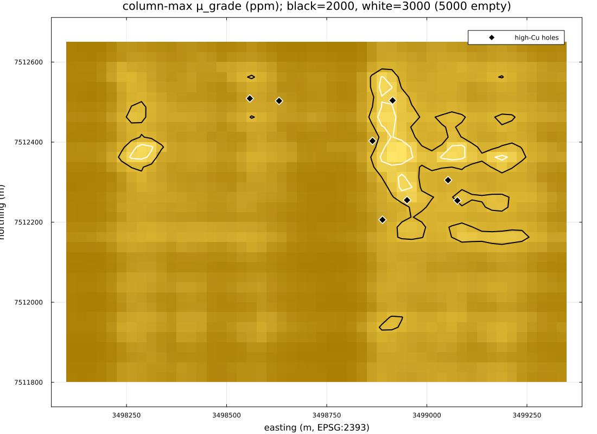
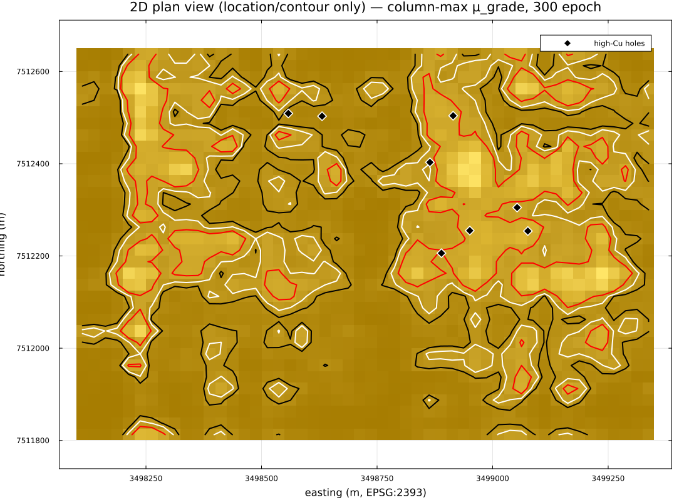
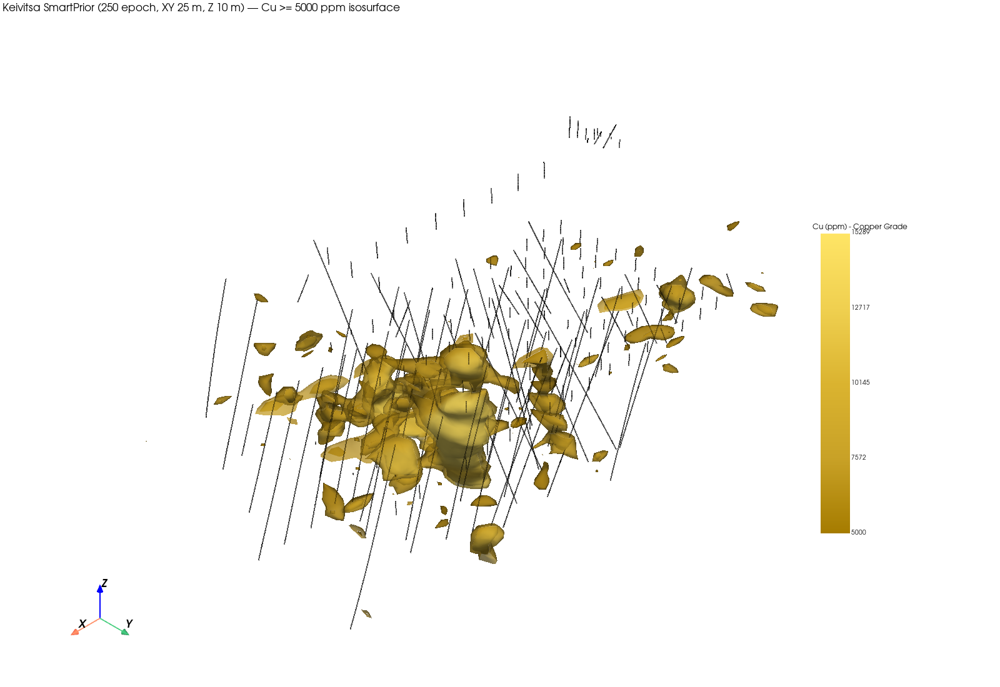
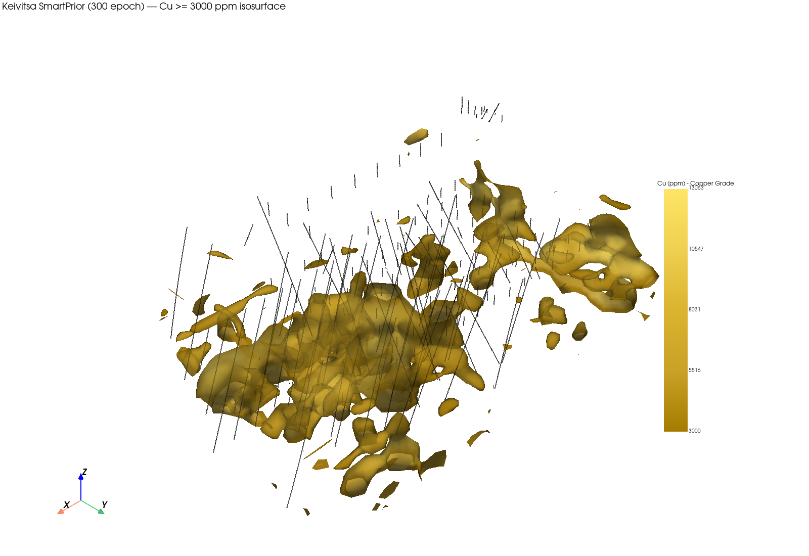
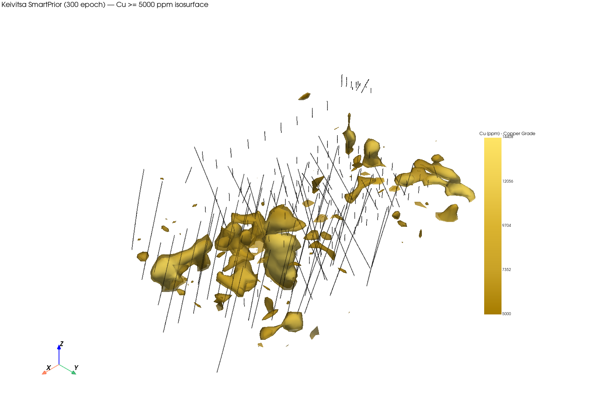

# SmartPrior — Geochemistry + Petrophysics Pipeline

**One line:** a Julia/Lux.jl neural field that predicts ore grade, density,
magnetic susceptibility, and (unverified) resistivity on every cell of a 3D
block model, trained only on sparse geochemistry, lithology, drill assays,
and petrophysical measurements — no gravity, no MT, no other geophysics as
input.

The active line of work is this **non-geophysical prior**. It is trained and
exported on the **Keivitsa (GTK, Finland)** open dataset as a case study, not
as a claim that the same weights transfer to other deposits. A new site
needs the same *kinds* of files (collars, surveys, assays, geochemistry,
lithology, petrophysics) in the layout `src/KeivitsaIO.jl` already reads.

An earlier gravity + MT pipeline (warm-start prior for VFSA) is still in
the repo (`examples/compare_prior_2d.jl`, `examples/musgrave_*.jl`) and its
run directories live under `archive/mt_gravity_tmp_outputs/`. The two
pipelines share Grid / PriorNet / Train utilities, but not inputs, outputs,
or the training loop. This pipeline does **not** feed VFSA.

---

## Status

| Question | Answer |
|---|---|
| A value on every cell? | **Yes** — 23,800 cells at 25 m Z, 57,800 at 10 m Z; 0 NaN |
| High-grade contrast vs assays? | **Close, compressed** — predicted high/background ≈ 5.8× vs assay ≈ 6.7× (25 m grid, best 300-epoch checkpoint) |
| 3D shape? | **Partly** — plan-view location matches known high-Cu holes; the 5,000 ppm isosurface is fragmented, not a continuous shell |
| Petrophysics provenance? | **Partial** — density and susceptibility are high-confidence inferences from GTK's combined measurement suite; `LUO_R` resistivity is unverified and must not be treated as calibrated |
| Connected to VFSA? | **No.** Deferred — see [Relationship to VFSA](#relationship-to-vfsa) |

---

## Data (not in this repository)

Training does not download anything. `examples/train_keivitsa_prior.jl`
reads a local GTK package:

```
KEIVITSA_ROOT  (or, if unset, ~/nisai/minerai-code/database/keivitsa)
├── config.yaml                          # train.grid_bounds
├── processed/keivitsa_cleaned_intervals.csv
└── source/gtk/report/
    ├── 3_DRILLINGS/Logs/Shape_files/    # collar.dbf, survey.dbf, rocktype.dbf, lithdesc.dbf
    ├── 3_DRILLINGS/Assays/Shape_files/  # Cu intervals (grade anchors)
    ├── 3_DRILLINGS/.../petro.txt        # PTR_D/J, DSR_D/J, LUO_R
    └── 4_GEOCHEMISTRY/*.dbf             # till/bedrock surface chemistry
```

Set `KEIVITSA_ROOT` if the package lives somewhere else. `5_GROUND_GEOPHYSICS`
is in the GTK tree and is **not** opened. Tiny copies for unit tests only:
`test/fixtures/`.

`tmp_keivitsa_prior*/` directories are **outputs** (checkpoints, VTK, PNGs),
not the source data.

---

## Input

Three data families. No gravity, no MT.

| # | Channel group | Source | Count (Keivitsa) | Role |
|---|---|---|---:|---|
| 1 | Position | grid centres | — | x, y, z → Fourier encoding (`n_bands=4`) |
| 2 | Geochemistry (surface) | `4_GEOCHEMISTRY/*.dbf` | 971 | Cu, Ni, Co, Pd, Au + Ni/Cu, Pd/Ni, Co/Ni |
| 3 | Geochemistry (drill, supplementary) | `processed/keivitsa_cleaned_intervals.csv` | 16,215 | S, Fe, Cr, Pt — elements missing from the surface survey |
| 4 | Lithology | `rocktype.dbf` / `lithdesc.dbf` | 3,724 | ROCKTYPE, one-hot |
| 5 | Coverage | derived | — | Distance to nearest geochemistry/lithology sample |

Where surface and drillhole geochemistry overlap on the same element, the
**surface sample wins**. Drill Cu is the grade *target* (anchor), not a
feature.

Encoded feature width on the Keivitsa grid is 54 (30 named channels after
Fourier bands on coordinates).

---

## Architecture

```
[position, geochemistry, lithology, coverage]  (30 named channels → 54 after encoding)
                    │
          Fourier positional encoding (coordinates only)
                    │
              PriorNet (Lux.jl MLP, gelu)
         default width = 128, depth = 4
         capacity experiment used width = 256
                    │
        ┌───────────┼───────────┬──────────────┐
   mu_grade    mu_density  mu_susceptibility  mu_resistivity
   sigma_grade sigma_density sigma_susceptibility sigma_resistivity
```

Eight outputs (`Dense(width => 8)`): four properties, each with a mean (`μ`)
and a heteroscedastic uncertainty (`σ`). Default CLI width is **128**;
`width=256` was a capacity run, not the script default.

**Per cell:**
- `μ` — point estimate written into the block model (`μ_grade` is Cu_Log;
  exported `grade` is `10^μ_grade` in ppm).
- `σ` — learned cell-wise uncertainty via heteroscedastic NLL in
  `src/Losses.jl`. After the data-driven floor (`σ ≥ 1 ×` group std of the
  anchors), most anchors sit on that floor, so `σ` currently carries little
  cell-to-cell information.

Resistivity is **still trained** (fourth head, loss weight 1). It is not
removed from the graph. It is flagged unverified (`KEIVITSA_PETRO_STATUS.LUO_R`)
and must not be used as a physical property or a VFSA starting model.

---

## Output — anchors and confidence

Supervision is only at anchor cells. The rest of the grid is filled by the
learned geochemistry/lithology → property map. There is no kriging-style
spatial continuity prior: distant cells can get similar predictions if their
features match.

| Property | Anchor source | Cells (25 m) | Cells (10 m Z) | Confidence |
|---|---|---:|---:|---|
| `grade` (Cu_Log) | Drill assays | 988 | 1,969 | Direct measurement |
| `density` | `PTR_D` + `DSR_D` | 936 | 1,862 | High-confidence inference |
| `susceptibility` | `PTR_J` + `DSR_J` | 936 | 1,862 | High-confidence inference |
| `resistivity` | `LUO_R` | 524 | 1,077 | **Unverified — trained, not trusted** |

### Petrophysics provenance

`petro.txt` has no column dictionary in the GTK report package. GTK's
published combined density–susceptibility–remanence measurement (Puranen;
national database ~130,000 samples) is strong circumstantial support for:

- `PTR_D` / `DSR_D` → density (kg/m³; NLL uses g/cm³)
- `PTR_J` / `DSR_J` → magnetic susceptibility
- `PTR_K` / `DSR_K` → likely remanence — **parsed, not used** (candidate 5th
  property)

`LUO_R` (range ~0.11–1.2×10⁶, consistent with Ω·m) has **no** supporting
source. It is read and trained; do not treat `μ_resistivity` as calibrated.

---

## Relationship to VFSA

Not connected. VFSA2D in this package accepts a log-resistivity starting
grid only. That is the unverified head. Grade / density / susceptibility
would need a petrophysical translation before they could warm-start MT
inversion. Explicitly deferred.

---

## Key experiments

Same 971 + 16,215-point geochemistry input unless noted. Grid: 50×34×N,
25 m in X/Y, EPSG:2393 (KKJ Finland Zone 3). Numbers below are from the
run directories `tmp_keivitsa_prior*` (gitignored diagnostic outputs).

### 1) Training budget (epochs)

25 m Z, width 128, depth 4, resistivity included, **no** σ floor.

| | 30 epoch (`tmp_keivitsa_prior`) | 300 epoch, best = 250 (`tmp_keivitsa_prior_e300`) |
|---|---:|---:|
| log10-RMSE (988 grade anchors) | 0.460 | **0.249** |
| High-grade pred/background | 2.65× | **5.81×** |
| Assay high/background (reference) | 6.72× | 6.72× |
| Max predicted Cu (ppm) | 3,831 | 16,751 |
| Cells ≥ 5,000 ppm | 0 | 621 |

More training closed most of the amplitude-compression gap. Loss ticked
back up between epoch 250 and 300 (density NLL 0.191 → 0.314);
`train_prior` keeps the best checkpoint.

### 2) Z-axis grid resolution

Hypothesis: 10 m Z instead of 25 m would connect the fragmented isosurface.

| | 25 m Z, ep. 250 (`e300` checkpoint) | 10 m Z, ep. 250 (`tmp_keivitsa_prior_z10`) |
|---|---:|---:|
| Cells | 23,800 | 57,800 |
| log10-RMSE | 0.249 | 0.291 |
| High-grade pred/bg | 5.81× | 5.86× |
| Fragmented 5,000 ppm shell? | Yes | **Still yes** |

**Hypothesis rejected.** Finer Z did not connect the fragments and did not
improve RMSE.

### 3) Sigma floor

Without a floor, density `σ` collapsed below the group std and NLL went
negative. Current training code floors `σ ≥ 1 ×` group std per property
(`sigma_bounds_from_anchors` in `examples/train_keivitsa_prior.jl`).

| | No floor (e300, best ep. 250) | With floor (`tmp_keivitsa_prior_sigmafloor`, best ep. 200) |
|---|---:|---:|
| Total NLL | −5.12 | **+0.66** |
| Anchors sitting at the floor | — | 87–100% across properties |

Fixes the negative-NLL artifact. `σ` then loses most cell-to-cell range.

> Value share is not gradient share. Tables above are loss *values*, not
> which term is driving updates.

### 4) Network capacity

25 m Z, 250 epoch, σ floor on.

| width | depth | log10-RMSE | pred/bg | wall | run dir |
|---:|---:|---:|---:|---:|---|
| 128 | 4 | 0.287 | 5.55× | — | `tmp_keivitsa_prior_sigmafloor` |
| **256** | 4 | **0.232** | 5.78× | 395 s | `tmp_keivitsa_prior_wide` |
| 128 | 6 | 0.281 | 5.72× | 312 s | `tmp_keivitsa_prior_deep` |

Width helped RMSE; it did **not** move high-grade contrast (~5.5–5.8× vs
assay 6.72×). Default `SMARTPRIOR_WIDTH` is still 128.

---

## Visual results

Figures are **not** written during training. After a checkpoint exists:

```bash
julia --project=. examples/export_keivitsa_blockmodel.jl
```

That script (1) rebuilds the same feature stack, (2) predicts `μ` /
`grade_ppm = 10^μ_grade` on the full grid, (3) writes a VTK StructuredGrid,
(4) a 2D column-max plan (Plots.jl), and (5) 3D marching-cubes isosurfaces
via PyVista (`render_orebody_pyvista`: Gaussian blur σ = 0.25, Taubin
smooth, gold palette, isometric camera, optional NISAI drill traces).

### Plan view (column-max μ_grade — location/contour only)

30 epoch, 25 m. Contours at 2,000 / 3,000 ppm; 5,000 ppm was empty at this
budget. Diamonds = high-Cu holes.



300 epoch (best checkpoint 250), 25 m — tighter around known high-Cu holes;
5,000 ppm contour is non-empty (621 cells).



### 3D isosurface

SmartPrior, 25 m XY / 10 m Z, 250 epoch, Cu ≥ 5,000 ppm (1,038 cells).
PyVista isometric view, drill traces overlaid. This is a screenshot of the
predicted grade field, not an inversion.



Same 300-epoch / 25 m-Z checkpoint at 3,000 ppm and 5,000 ppm:





---

## How to run

Julia 1.10+, from the repo root:

```bash
julia --project=. -e 'using Pkg; Pkg.instantiate()'
julia --project=. examples/train_keivitsa_prior.jl
julia --project=. examples/export_keivitsa_blockmodel.jl
```

Useful environment variables (both scripts):

| Variable | Default | Meaning |
|---|---|---|
| `KEIVITSA_ROOT` | `~/nisai/minerai-code/database/keivitsa` | GTK package root |
| `SMARTPRIOR_WORK` | `tmp_keivitsa_prior/` | checkpoint + export directory |
| `SMARTPRIOR_CELL_M` | 25 | XY cell size (m) |
| `SMARTPRIOR_CELL_Z` | same as XY | vertical cell size (m) |
| `SMARTPRIOR_EPOCHS` | 100 | training budget (reported runs used 250–300) |
| `SMARTPRIOR_WIDTH` | 128 | MLP width |
| `SMARTPRIOR_DEPTH` | 4 | MLP depth |
| `SMARTPRIOR_TAG` | `""` | export filename suffix (`_z10`, `_e300`, …) |
| `SMARTPRIOR_PYTHON` | auto | PyVista interpreter for 3D PNGs |

Outputs in `SMARTPRIOR_WORK`: `keivitsa_prior.jld2`,
`keivitsa_smartprior_blockmodel*.vts` (hand-written VTK, no WriteVTK.jl),
plan/isosurface PNGs (3D PNGs need PyVista), `keivitsa_prior_report.txt`.

Tests: `julia --project=. -e 'using Pkg; Pkg.test()'`.

---

## Repository layout

| Path | Role |
|---|---|
| `src/KeivitsaIO.jl` | GTK readers (this pipeline) |
| `src/{Grid,Features,PriorNet,Losses,Train}.jl` | shared neural-field stack |
| `examples/train_keivitsa_prior.jl` | train |
| `examples/export_keivitsa_blockmodel.jl` | VTK + figures |
| `tmp_keivitsa_prior*/` | current diagnostic runs (gitignored) |
| `archive/mt_gravity_tmp_outputs/` | archived gravity+MT / Musgrave runs |
| `examples/compare_prior_2d.jl`, `examples/musgrave_*.jl` | legacy gravity+MT examples |

---

## Data licensing note

Keivitsa originates from GTK's open data release. A parallel look at
Ontario Geological Survey drillhole / specific-gravity / susceptibility
databases found them downloadable, but Ontario's Terms of Use restrict
**"substantial reproduction"** without prior written permission. Do not
assume that data is open-for-training.

---

## Open questions

1. **High-grade contrast** does not move with network capacity. Not yet
   diagnosed (feature ceiling vs mean-NLL under-weighting rare highs vs
   only 60 of 988 anchors ≥ 5,000 ppm).
2. **No gradient-level loss decomposition** in this pipeline — pay tables
   are value shares only.
3. **`PTR_K`/`DSR_K`** (likely remanence) — candidate 5th output.
4. **`LUO_R` resistivity** — trained, unverified. Needed if VFSA
   integration returns.
5. **Isosurface fragmentation** — Z: 25→10 m ruled out; XY resolution,
   ensemble methods, envelope masking not tested.

---

## License

MIT. See `LICENSE`.
