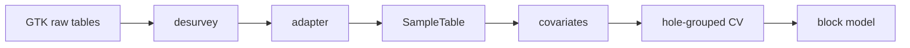

# SmartPrior

A Julia / Lux.jl neural field that predicts a rock property, and its uncertainty, at any 3D point from sparse drillholes. The primary test site is Keivitsa (GTK, Finland): copper is complete, density is complete. Cloncurry is the sparse-spacing reference.


*Predicted σ for log10 Cu. Kriging (v1) stays near 0.4–0.45; the neural field is 0.5–1.2, larger near isolated holes, the edges of the drilled volume, and the surface.*

> **Correction (2026-09-25).** GeoStats.jl, in the version pinned here, returns ordinary-kriging predictions as `Normal(μ, σ²)`: the second parameter is the kriging *variance*. Earlier runs read it as the standard deviation, so every kriging σ and kriging coverage reported before this date is wrong. Kriging means, RMSE and skill are unaffected, and so are all neural-field results. `kriging_predict` now checks the behaviour on a known case and takes the square root when needed (`examples/check_kriging_sigma.jl`). The corrected numbers are below. The coverage, calibration, 3D and section figures in `docs/figures/` were regenerated with the corrected kriging σ.

## Key results

Skill is `1 − RMSE / RMSE_mean`, pooled over held-out samples, with 10-fold hole-grouped cross-validation. Coverage is the share of held-out samples inside the 90 % interval (nominal 0.90).

| Site / target | Holes | Samples | Kriging (v1) skill | Neural field skill | Kriging (v1) coverage | Neural field coverage |
|---|---:|---:|---:|---:|---:|---:|
| Keivitsa Cu (log10 ppm) | 261 | 15,859 | 0.106 | 0.151 (`nn_xyz`) | 0.78 | 0.87 |
| Keivitsa density (kg/m³) | 263 | 30,908 | 0.058 | 0.059 (`nn_xyz`), 0.065 (`nn_cov`) | 0.77 | 0.89 (`nn_xyz`), 0.90 (`nn_cov`) |

**Copper.** The neural field is non-inferior to kriging (v1): all three pre-registered conditions pass. The pooled difference is not significant. Both methods under-cover; kriging (v1) is more overconfident (0.78 vs 0.87). The earlier claim of 0.48 kriging coverage came from the variance bug.

**Density.** Coordinates carry little information about density: RMSE falls from 146.1 to 137.5 kg/m³ against the training mean. The pre-registered rule is not met (`useful = 0`): skill is below 0.10, although its 95 % interval (0.003 … 0.114 for `nn_xyz`) sits above 0. Per hole, the network beats kriging (v1) on 153 of 263 holes, mean paired skill difference +0.055 (0.016 … 0.093). The network's intervals are well calibrated (0.89–0.90); kriging (v1) is overconfident (0.77).

**Cloncurry.** At 100–370 m hole spacing with 4–11 holes per site, no method beats the mean.


*Pooled Cu skill. Neural field (`nn_xyz` / `nn_cov`) sits above the 0.10 line; intervals overlap kriging (v1).*


*Held-out predicted vs observed. Both methods track the 1:1 line; the neural field is not a mean collapse.*


*90 % coverage by fold (corrected kriging σ). Kriging (v1) stays ~0.75–0.81; `nn_xyz` is closer to the nominal 0.90.*


*Predictive calibration (corrected σ). Neural-field intervals are closer to the diagonal than kriging (v1).*


*Block-model μ (log10 Cu), kept blocks ≤60 m from a hole. Kriging is grainier; the neural field is smoother.*


*E–W section through mean drilling northing. Bottom row: kriging σ is nearly flat; neural-field σ rises near the surface and gaps.*


*Blocks with μ ≥ 2.5 (≈316 ppm Cu). Shell geometry differs; count of blocks above threshold is higher for the neural field.*

## Pipeline




*Five-member ensemble. Coordinates are Fourier-encoded (16 bands); other covariates are appended. A 3 × 64 GELU MLP emits μ and softplus σ. The cross-validation uses `build_mlp` in `examples/feasibility_loho.jl`, not `src/PriorNet.jl`.*

## Quick start

Set `KEIVITSA_ROOT` to the unpacked GTK `source/gtk` tree. Data stay outside the repo.

```bash
julia --project=. -e 'using Pkg; Pkg.instantiate()'
julia --project=. -e 'using Pkg; Pkg.test()'

# sanity checks, no GTK data needed (seconds)
julia --project=. examples/check_kriging_sigma.jl
julia --project=. examples/check_binned_variogram.jl

# Keivitsa cross-validation; target = cu (default) | density | susceptibility
export KEIVITSA_ROOT=/path/to/gtk
julia --project=. examples/feasibility_keivitsa.jl
SMARTPRIOR_TARGET=density julia --project=. examples/feasibility_keivitsa.jl

julia --project=. examples/diagnose_nn_keivitsa.jl
julia --project=. examples/keivitsa_run2_checks.jl
julia --project=. examples/keivitsa_blockmodel.jl
julia --project=. examples/figures_data.jl
julia --project=. examples/figures_training.jl
julia --project=. examples/figures_results.jl
julia --project=. examples/figures_3d.jl
```

Outputs go to `tmp_feasibility_keivitsa/` for Cu and `tmp_feasibility_keivitsa_<target>/` for other targets (all gitignored). The script refuses a non-empty work directory and a leftover `.run.lock`, so two runs cannot share one output folder. It logs a runtime estimate after the first fold; the density run took 3.2 h on a MacBook Air.

## Repository layout

| Path | Role |
|---|---|
| `src/SmartPrior.jl` | module entry |
| `src/{Schema,Sites,Covariates,Desurvey}.jl` | site schema, covariates, desurvey |
| `src/{CloncurryIO,KeivitsaIO}.jl` | adapters to `SampleTable` |
| `src/{Grid,Features,PriorNet,Losses,Train,Metrics}.jl` | legacy grid stack |
| `src/SyntheticFields.jl` | seedable Gaussian fields |
| `sites/*.toml` | site boxes, CRS, properties |
| `examples/keivitsa_inspect.jl` | data checks |
| `examples/diagnose_nn_keivitsa.jl` | synthetic stopping diagnosis |
| `examples/feasibility_keivitsa.jl` | 10-fold Keivitsa CV, target set by `SMARTPRIOR_TARGET` |
| `examples/keivitsa_run2_checks.jl` | byte compare, coverage, variograms |
| `examples/keivitsa_blockmodel.jl` | final Cu block model |
| `examples/figures_{data,training,results,3d}.jl` | report figures |
| `examples/feasibility_loho.jl` | Cloncurry leave-one-hole-out; shared kriging and network code |
| `examples/feasibility_keivitsa_pilot.jl` | 30-hole pilot |
| `examples/check_kriging_sigma.jl` | kriging σ is a standard deviation (known case) |
| `examples/check_binned_variogram.jl` | streaming variogram bins equal stored-pair bins |
| `examples/synthetic_exp1.jl` | synthetic-field experiment |
| `examples/variogram_cloncurry.jl` | Cloncurry variograms |
| `examples/kriging_cloncurry_petro.jl`, `examples/kriging_env/` | Cloncurry petrophysics kriging |
| `examples/calibration_plot_cloncurry.jl` | Cloncurry calibration plot |
| `examples/export_cloncurry_blockmodel.jl` | Cloncurry block-model export |
| `docs/figures/` | figures cited in the reports |
| `docs/2026-09_keivitsa_technical_report.md` | Keivitsa report |
| `docs/2026-09_cloncurry_feasibility_report.md` | Cloncurry report |
| `docs/keivitsa_data_notes.md` | GTK conventions, statistics only |

Full write-up: [Keivitsa technical report](docs/2026-09_keivitsa_technical_report.md). The report carries the corrected kriging coverage and σ, and a density section.

## Notes

- The kriging variogram step counts point pairs without storing them (memory O(bins) instead of O(n²)). The stored-pair version ran out of memory on Keivitsa density, about 250 million pairs per fold; the check script shows the bins are bit-identical.
- Kriging (v1) pins the vertical range at the optimiser bound in most folds for both Cu and density. Kriging (v2) is the next baseline.
- GTK data are never committed. Check the GTK licence terms before publishing figures derived from the data.
- The legacy scripts `examples/train_cloncurry_prior.jl` and `examples/holdout_cloncurry_prior.jl` fed held-out holes' own geochemistry into the network; do not cite those RMSE tables.
