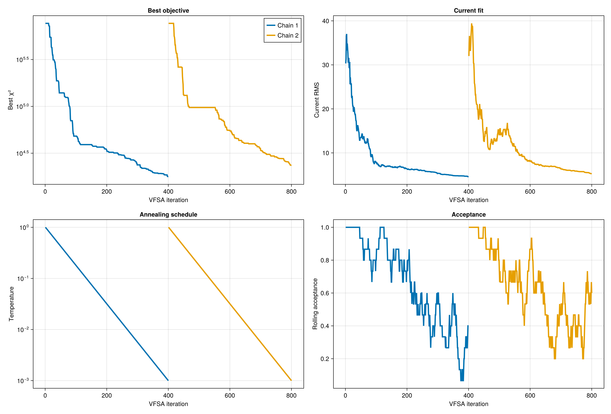
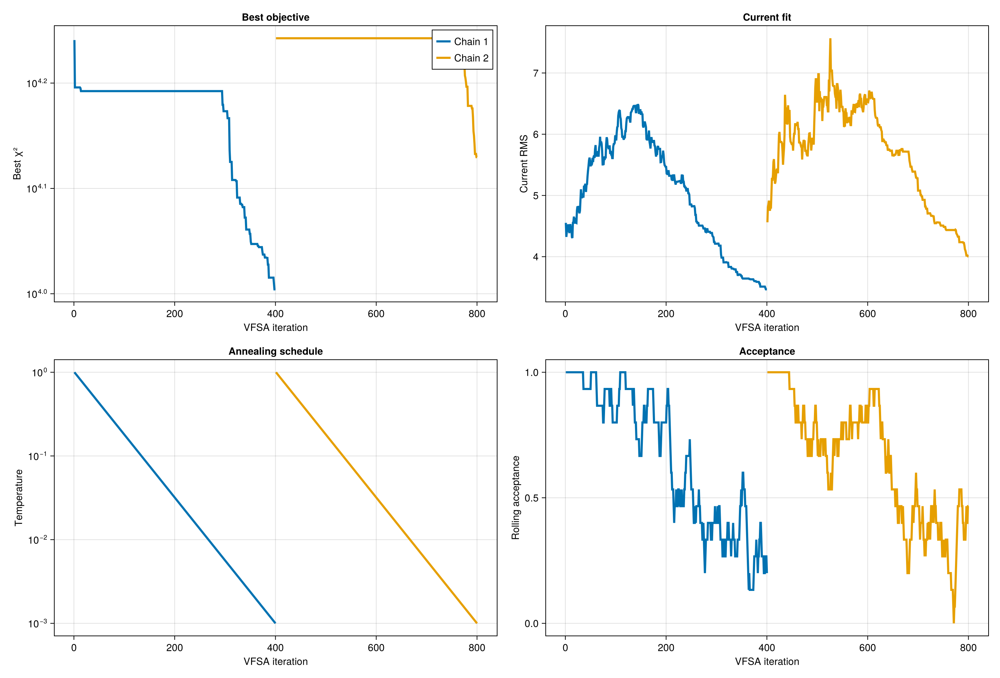
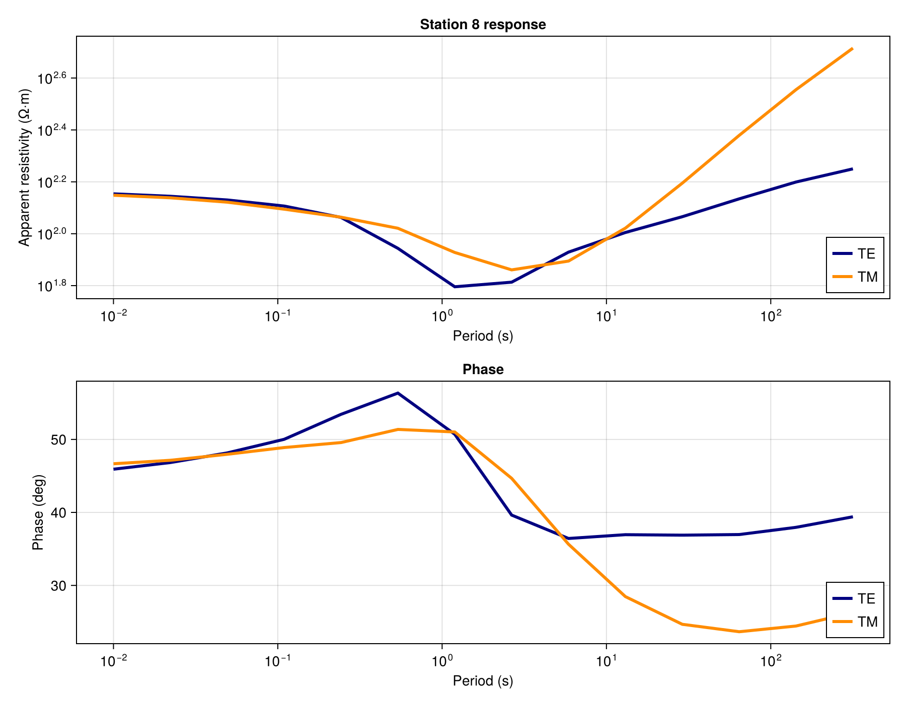
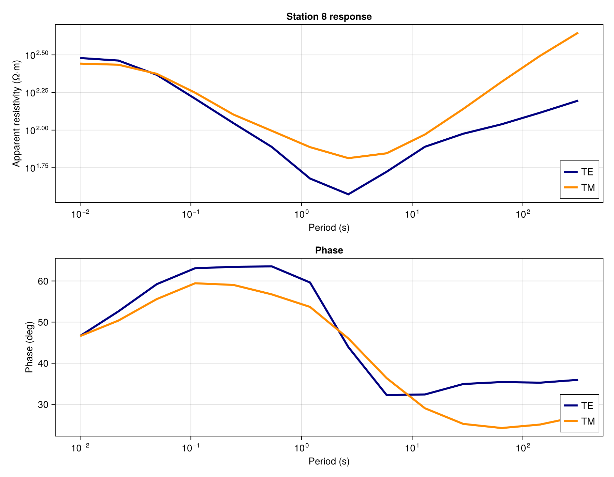
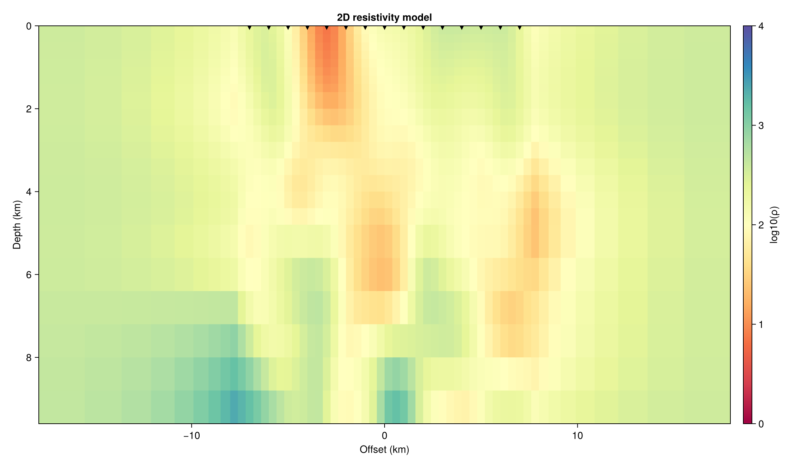
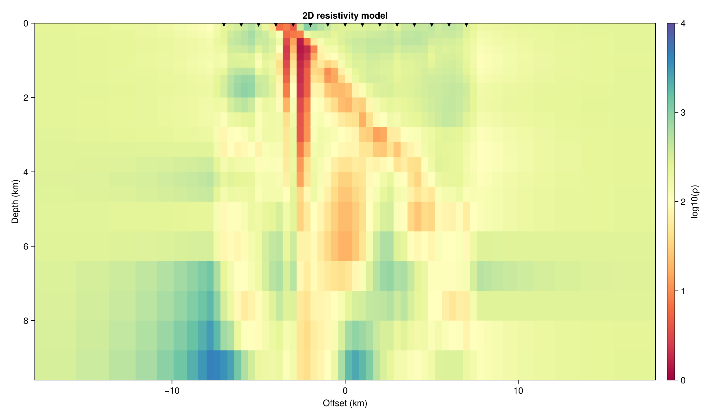

# SmartPriorMT

**One line:** instead of starting 2D MT (magnetotelluric) inversion from a
flat half-space, we start from a "smart" prior model built from gravity +
MT data, and test whether this speeds up the inversion.

Version 0.1.0 · Julia 1.10 · MTGeophysics 0.5.0
Full tables, ablations, and figures: [`docs/ARA_RAPOR.md`](docs/ARA_RAPOR.md)

---

## Summary (TL;DR)

| Question | Answer |
|---|---|
| Does the prior fit the data faster? | **Yes** — consistently, from the start, in 3/3 seeds |
| Does the prior match the true model better? | **Partly** — structural correlation improves, absolute amplitude (RMSE) is unclear |
| Does it work for every geological scenario? | **No** — it can fall behind on steep-dip / resistive-contrast structures |
| Does the VFSA search reach its target (RMS = 1.0)? | **No** — increasing the budget (400→3000) brought less than half the expected gain; the bottleneck is no longer `max_iter`, it's the RBF parametrization |

This project is not a joint inversion. Gravity is only used to build the
prior; it does not enter VFSA's own search process (χ²).

---

## What is the project?

```
Gravity + MT data (Niblett–Bostick) → Lux network → Prior model (μ, σ)
                                                    → VFSA2DMT (as the starting model)
```

Goal: give the prior as the starting point and see whether VFSA's search
(a) fits the data faster, and (b) produces a result that is closer to the
true model. The forward solver, perturbation, and cooling schedule do not
change — only the starting point changes.

---

## Main Findings

### 1) The prior fits the data faster

Across 3 different seeds, VFSA's data fit (data RMS) after 400 iterations:

| Seed | Half-space | Prior | Improvement |
|---|---:|---:|---:|
| t1 | 4.60 | 3.47 | 25% |
| t2 | 5.02 | 3.64 | 27% |
| t3 | 5.15 | 3.82 | 26% |

Most of this difference comes from the starting point: from iteration one,
the prior already has much lower error than the half-space (~4.6 vs ~30).

**Example (t1): convergence and data fit, half-space vs prior**

| Half-space | Prior |
|---|---|
|  |  |
|  |  |

### 2) Match with the true model: structure yes, amplitude unclear

| Metric | Result |
|---|---|
| Correlation (with true model) | Prior is higher in 3/3 seeds (e.g. 0.30 vs 0.21) |
| RMSE (with true model) | Inconsistent — prior is better in some seeds, not in others |

Interpretation: the prior captures the *structure* (where conductive /
resistive zones are) more accurately, but there is no guaranteed gain in
absolute resistivity values.

**Example (t1): mean model after inversion, compared to the true model**

| Half-space | Prior |
|---|---|
|  |  |

### 3) It doesn't work for every geology

Across 4 different synthetic geology scenarios (no VFSA, direct prior vs NB
comparison): the prior is clearly better for shallow/medium-dip conductive
structures, but falls behind for steep-dip or resistive-contrast structures.

**For full tables, ablation results, sigma/uncertainty analysis, and
Musgrave (real data) results, see:** [`docs/ARA_RAPOR.md`](docs/ARA_RAPOR.md)

---

## Conclusion: Not a VFSA Budget Problem — a Parametrization Bottleneck

The results above were obtained with `max_iter=400`. The target data fit
(`target_rms=1.0`) — current results stay above this. To address it, we
tested increasing the budget in steps: 400 → 800 → 3000 iterations.

**Effect of budget on t1 (best chain, final RMS):**

| budget | prior | half-space |
|---|---:|---:|
| 400 | 3.47 | 4.60 |
| 800 | 2.90 | 3.87 |
| 3000 | **2.64** | **3.50** |

**The conclusion is now clear:**

- **The original 400-iteration diagnosis was correct** — that was not a
  "plateau," it was a short budget.
- **But 3000 isn't enough either.** Going from 800 to 3000 used 5.5× more
  iterations, but delivered less than half of the hoped-for gain. In the
  last 200 iterations the slope is ~−0.0003/iter, acceptance rate 4–9% —
  the search has almost stopped in the cold regime. The remaining gap
  (~1.6 RMS) no longer closes with more iterations.
- **The likely cause is the RBF parametrization.** 250 control points and a
  ~800–1000 m kernel width may not be enough to represent the noisy (5%)
  2D data down to RMS=1.0. `step_scale` was not the bottleneck.
- **This is not the prior "locking" the search.** The prior consistently
  fits the data better than the half-space (2.64 vs 3.50) — this is a real
  advantage from the starting point, not a search artifact. The half-space
  gets closer with more budget, but does not overtake it.
- **True-model RMSE remains a separate question.** VFSA fits the noisy
  data; a lower data RMS does not automatically mean the result is closer
  to the true model (see the "match with the true model" finding above).

**Practical takeaway:** the 400-iteration table above comes from a
start-dependent, not-fully-converged search — but this does not invalidate
the finding that the prior speeds up data fitting. If RMS=1.0 is the goal,
the next lever is not `max_iter`; it's increasing `n_ctrl`, using a
narrower RBF kernel, or a different parametrization.

---

## Next Steps

1. Tune the RBF parametrization: increase `n_ctrl` and/or use a narrower
   kernel (smaller `rbf_sigma_scale`) — single-seed probe on t1
2. If the probe gets closer to RMS=1.0, re-run the full 3-seed validation
   with the new parametrization
3. `max_iter` is no longer the lever — the budget can stay fixed at 400,
   and the freed-up time can go into this parametrization search instead

---

## Installation and Quick Start

```julia
using Pkg
Pkg.activate(".")
Pkg.instantiate()
```

```bash
julia --project=. examples/compare_prior_2d.jl
```

Runs a half-space vs prior comparison on a synthetic dipping conductive
slab (same seed, same VFSA settings). For other example commands
(ablation, blind protocol, geology sweep), see
[`docs/ARA_RAPOR.md`](docs/ARA_RAPOR.md).

| Package | Compat |
|---|---|
| ArchGDAL | 0.10.12 |
| ComponentArrays | 0.15.47 |
| ForwardDiff | 1.4.5 |
| Interpolations | 0.15.1 |
| JLD2 | 0.6.6 |
| Lux | 1.31.4 |
| MTGeophysics | 0.5.0 |
| Optimisers | 0.4.9 |
| Plots | 1.41.7 |
| Zygote | 0.7.12 |
| julia | 1.10 |

---

## Known Limitations (brief)

- **Single-lithology assumption:** a single gravity–resistivity slope is
  used; reliability drops in mixed-lithology settings (e.g. Musgrave).
- **TE-only:** TM mode exists, but station-wise error calibration is not
  implemented yet.
- **`σ` is not a calibrated uncertainty map** — and it does not enter the
  inversion either.
- **Partial inverse crime:** present in the gravity operator (the same
  forward model is used for both synthetic data generation and inversion),
  not present on the petrophysics or MT side.
- **3D warm-start is out of scope** — the upstream package (`MTGeophysics`)
  does not support cell-wise bounds.
- **The VFSA budget still doesn't reach the target** (details above).

Full list and rationale: [`docs/ARA_RAPOR.md`](docs/ARA_RAPOR.md)

---

## License

MIT, see [LICENSE](LICENSE).