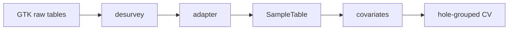

# SmartPrior

A Julia / Lux.jl neural field that predicts a rock property, and its uncertainty, at any 3D point from sparse drillholes. The primary test is Keivitsa Cu; Cloncurry is the sparse-spacing reference.


*Predicted σ for log10 Cu. Kriging (v1) stays near 0.15–0.2; the neural field is larger near isolated holes and the surface.*

## Key results

On Keivitsa Cu (261 holes, 10-fold hole-grouped CV) the neural field is non-inferior to kriging (v1): skill 0.151 vs 0.106; the pooled difference is not significant.

Its uncertainty is calibrated: 90 % intervals cover 0.74–0.92 per fold vs 0.43–0.54 for kriging (v1).

At Cloncurry's sparse spacing no method beats the mean.


*Pooled skill on all 15,859 Keivitsa Cu samples. The neural-field interval sits above 0 and overlaps kriging (v1).*

## Pipeline




*Five-member ensemble. Coordinates are Fourier-encoded; other covariates are appended. The head emits μ and σ.*

## Quick start

Set `KEIVITSA_ROOT` to the unpacked GTK `source/gtk` tree. Data stay outside the repo.

```bash
julia --project=. -e 'using Pkg; Pkg.instantiate()'
julia --project=. -e 'using Pkg; Pkg.test()'

julia --project=. examples/diagnose_nn_keivitsa.jl
julia --project=. examples/feasibility_keivitsa.jl
julia --project=. examples/keivitsa_run2_checks.jl
julia --project=. examples/keivitsa_blockmodel.jl
julia --project=. examples/figures_data.jl
julia --project=. examples/figures_training.jl
julia --project=. examples/figures_results.jl
julia --project=. examples/figures_3d.jl
```

The feasibility script refuses a non-empty work directory and a leftover `.run.lock`, so two runs cannot share one output folder.

## Repository layout

| Path | Role |
|---|---|
| `src/SmartPrior.jl` | module entry |
| `src/{Schema,Sites,Covariates,Desurvey}.jl` | site schema, covariates, desurvey |
| `src/{CloncurryIO,KeivitsaIO}.jl` | adapters to `SampleTable` |
| `src/{Grid,Features,PriorNet,Losses,Train,Metrics}.jl` | legacy grid stack |
| `src/SyntheticFields.jl` | seedable Gaussian fields |
| `sites/*.toml` | site boxes, CRS, properties |
| `examples/diagnose_nn_keivitsa.jl` | synthetic stopping diagnosis |
| `examples/feasibility_keivitsa.jl` | 10-fold Keivitsa Cu CV |
| `examples/keivitsa_run2_checks.jl` | byte compare, coverage, variograms |
| `examples/keivitsa_blockmodel.jl` | final block model |
| `examples/figures_{data,training,results,3d}.jl` | report figures |
| `examples/feasibility_loho.jl` | Cloncurry leave-one-hole-out |
| `examples/feasibility_keivitsa_pilot.jl` | 30-hole pilot |
| `docs/figures/` | figures cited below |
| `docs/2026-09_keivitsa_technical_report.md` | Keivitsa report |
| `docs/2026-09_cloncurry_feasibility_report.md` | Cloncurry report |
| `docs/keivitsa_data_notes.md` | GTK conventions, statistics only |

Full write-up: [Keivitsa technical report](docs/2026-09_keivitsa_technical_report.md).

GTK data are never committed (basic licence: internal use and publication figures only). The legacy scripts `examples/train_cloncurry_prior.jl` and `examples/holdout_cloncurry_prior.jl` fed held-out holes' own geochemistry into the network; do not cite those RMSE tables.
