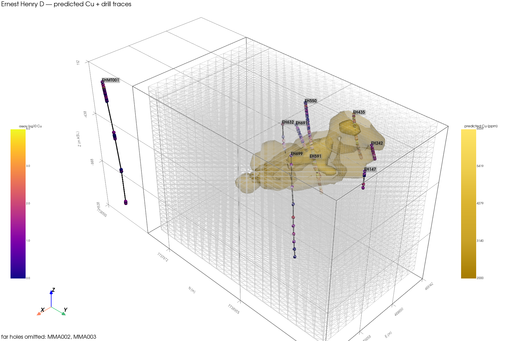

# SmartPriorMT — Cloncurry geochemistry + petrophysics prior

**One line:** a Julia/Lux.jl neural field that predicts ore grade, density,
magnetic susceptibility, and rock-specimen conductivity on every cell of a 3D
block model from sparse pXRF geochemistry, drillhole lithology, sample
coverage, and (in code) structural geology — **no gravity, no magnetics, no MT
as input**.

Active case study: **Cloncurry district** (Queensland; METAL package
`Cloncurry_integrated_2026-09-17`). Not a claim that the same weights transfer
to other deposits.

Keivitsa (GTK) was an earlier case study; see
[README_KEIVITSA_LEGACY.md](README_KEIVITSA_LEGACY.md). An older gravity + MT
example line remains under `examples/compare_prior_2d.jl` / `musgrave_*.jl` for
archive only — **out of scope** for this pipeline (not deferred, not connected).

---

## Status

| Question | Answer |
|---|---|
| Active dataset | Cloncurry district sample AABB (~118 × 219 km), 120 named holes |
| Fourth head | **`conductivity_100kHz`** — KT-20, 100 kHz, specimen-scale. **Not** MT bulk conductivity |
| Leak-free result | District drillhole hold-out 84/18/18, `split_seed=2026`, width=256 / depth=4 |
| Active mesh | **2300 m XY × 100 m Z** (default; refined from 200 m Z after variogram) |
| Density vs naive | Still loses after five independent interventions (see [Results](#results--district-drillhole-hold-out)) |
| Structural geology | Live: +16 channels → **69** total; scored under `…_w256_d4_geology/` |

---

## Why district (not Ernest Henry alone)

Ernest Henry has only **11** named holes. A leak-free 7/2/2 hole split showed
grade with a weak signal and density / susceptibility / `conductivity_100kHz`
all losing to naive
(`tmp_cloncurry_prior_eh_group_holdout/cloncurry_holdout_report.txt`). Shrinking
the net (64/2) did not rescue those heads — capacity was not the bottleneck.

The active grid is therefore the **district sample AABB** covering every
finite-xyz METAL row (~1,586 samples / **120** holes), with whole-collar
assignment ~70/15/15 → **84 / 18 / 18** holes (`split_seed=2026`).

---

## Data (not in this repository)

```
CLONCURRY_ROOT  (default ~/Desktop/datasets4HY/Cloncurry_integrated_2026-09-17)
├── derived/
│   ├── petrophysics_samples.csv
│   └── metal_all_fields.csv.gz
└── geology/
    ├── structures.geojson      # LineStrings (fault / contact / …)
    └── surface_geology.geojson # Polygons (dom_rock, rock_type)
```

`mt/`, `gravity/`, and `magnetics/` sit in the same package and are **not
opened**. Magnetics as an input channel is deliberately withheld pending a
separate go-ahead. Tiny fixtures: `test/fixtures/cloncurry_*`.

---

## Inputs (feature channels)

Built by `examples/holdout_cloncurry_prior.jl` /
`examples/train_cloncurry_prior.jl` via `src/CloncurryIO.jl` + `src/Features.jl`.
`Cu_Concentration` is the grade **target**, never a feature.

### Live district stack without geology — **53 channels**

From `tmp_cloncurry_prior_eh/cloncurry_prior_report.txt` `feature_names` and
the same builder (district AABB run used the same feature recipe before
geology was appended):

| Group | Count | Names / notes |
|---|---:|---|
| Coordinates | 3 | `x_norm`, `y_norm`, `z_norm` (→ Fourier `n_bands=4`) |
| Depth | 2 | `log_depth`, `depth_over_skin` |
| Geochemistry | **32** | `geochem_{Mg…U}` except Cu. Code lists 33 elements in `CLONCURRY_GEOCHEM_ELEMENTS`; **Co** is dropped when no finite positive ppm remain (`nearest_sample_channels`) |
| Drillhole lithology | 15 | `lith_AMP` … `lith_PSM`, `lith_OTHER` (one-hot; rare → OTHER) |
| Coverage | 1 | `sample_distance` |

### Structural geology (+16 → **69 channels**, live on district hold-out)

From `structure_channels` / `surface_geology_channels` on the geology and
Z=100 reports:

| Group | Count | Names |
|---|---:|---|
| Structure distance | 2 | `struct_fault_distance`, `struct_line_distance` (log1p distance / median cell, GDA94/MGA54 m) |
| Surface `dom_rock` | 11 | `surf_dom_ARENITE_RUDITE` … `surf_dom_QUARTZITE`, `surf_dom_OTHER` |
| Surface `rock_type` | 3 | `surf_rock_INTRUSIVE_UNIT`, `surf_rock_STRATIFIED_UNIT_INCLUDING_VOLCANIC_AND_METAMORPHIC`, `surf_rock_OTHER` |

Surface one-hots sit **beside** drillhole `lith_*`, not instead of them.
Fold / Layering are not separate channels (few lines; they only feed
`struct_line_distance`).

Geology-augmented district hold-out (69 channels, Z=200 m mesh):
`tmp_cloncurry_prior_district_holdout_w256_d4_geology/`. Current default
mesh is Z=100 m (see [Z-resolution refinement](#z-resolution-refinement)).

---

## Outputs

Eight heads (`Dense(width => 8)`): four properties × (`μ`, `σ`).
Heteroscedastic NLL with per-property σ floor = `1 ×` group std of train
anchors.

| Property | NLL units | Source column |
|---|---|---|
| `grade` | log10 Cu ppm | `Cu_Concentration` (`<LOD` → 1 ppm) |
| `density` | g/cm³ | `density_mean_g_cm3` |
| `susceptibility` | log10 SI | `susceptibility_mean_SI` (>0) |
| `conductivity_100kHz` | log10 S/m | `conductivity_mean_S_m_100kHz` (zeros → 0.01) |

**`conductivity_100kHz` is intentional naming.** KT-20 at 100 kHz on small
core specimens (Austin et al. 2024, §5.2.4). It is **not** MT-equivalent bulk
conductivity and must not be called resistivity or treated as an MT start
model. 711 / 1,250 finite values are exact 0 and are lifted to 0.01 S/m before
log10 (`CLONCURRY_COND_FLOOR_S_M`).

Architecture default for district hold-out: **width = 256**, **depth = 4**,
250 epochs (latest Z=100 m score below used a 100-epoch resume).

---

## Methodology — memorization vs hold-out

| Run | What it is | Cite as success? |
|---|---|---|
| `tmp_cloncurry_prior_eh/` | Ernest Henry box, **all** labels, 104 grade cells | **No** — in-sample fit (log10-RMSE **0.005**) |
| `tmp_cloncurry_prior_eh_group_holdout/` | EH 7/2/2 holes | Diagnostic only — showed EH is too thin |
| `tmp_cloncurry_prior_district_holdout_w256_d4/` | District **84/18/18**, 53 ch, Z=200 m | Leak-free; **before geology** |
| `…_w256_d4_geology/` | Same split + geology (69 ch), Z=200 m | Leak-free geology score |
| `…_w256_d4_z100/` | Same split + geology, **Z=100 m**, 100 epochs | **Current** district score |

Naive reference on district: train-mean RMSE on test holes for grade /
density / susceptibility; conductivity **floor** (−2 = log10 0.01 S/m) for
`conductivity_100kHz` (see report `naive` line).

> Value share is not gradient share. Loss-share tables (if printed) are
> term *values*, not which term drives parameter updates.

---

## Results — district drillhole hold-out

All rows below use the same collar split: **84 / 18 / 18** holes,
`split_seed=2026`, samples 1,105 / 251 / 230, width=256 / depth=4.

### With structural geology (Z = 200 m)

Source:
`tmp_cloncurry_prior_district_holdout_w256_d4_geology/cloncurry_holdout_report.txt`
(69 channels; grid (52, 96, 11) @ **2300 m × 200 m**; best epoch 200 / 250).

| property | test RMSE | naive | beats naive? |
|---|---:|---:|---|
| grade (log10 Cu) | **1.337** | 1.339 | **yes** (barely) |
| density | 0.590 | 0.469 | **no** |
| susceptibility | **1.341** | 1.612 | **yes** |
| `conductivity_100kHz` | **1.001** | 1.393 (floor) | **yes** |

### Before geology (same split, 53 channels, Z = 200 m)

Source:
`tmp_cloncurry_prior_district_holdout_w256_d4/cloncurry_holdout_report.txt`
(best epoch 200 / 250).

| property | test RMSE | naive | beats naive? |
|---|---:|---:|---|
| grade (log10 Cu) | **1.309** | 1.339 | **yes** |
| density | 0.606 | 0.469 | **no** |
| susceptibility | **1.364** | 1.612 | **yes** |
| `conductivity_100kHz` | **1.006** | 1.393 (floor) | **yes** |

Geology moved density slightly toward naive (0.606 → 0.590) and tightened
susceptibility / conductivity, but **did not** flip density past the
train-mean baseline. Grade edged worse (1.309 → 1.337) while still beating
naive by a hair.

Conductivity notes (geology report): train-mean baseline on test is
**0.953** — the net beats the floor but not train-mean. Grid μ is off the
floor (`cond_moved_off_floor=true`).

### Z-resolution refinement

Directional variograms on district finite-xyz samples
(`examples/variogram_cloncurry.jl` →
`tmp_cloncurry_variogram/cloncurry_variogram_summary.tsv`) showed grade’s
vertical range ≈ **305 m**. Against the then-default **200 m** Z cell that
is only **1.52×** cells — too coarse to resolve the vertical structure the
data support. Density / susceptibility / conductivity vertical ranges are
much longer (~1.9 km), so the coarseness argument is grade-led.

| property | R_major (m) | R_minor (m) | R_vert (m) | ani maj/min | ani maj/vert | R_vert / 200 m cell |
|---|---:|---:|---:|---:|---:|---:|
| grade | 211406† | 127122 | **305** | 1.66 | 694 | **1.52** |
| density | 36958 | 18286 | 1900 | 2.02 | 19.5 | 9.50 |
| susceptibility | 36673 | 21225 | 1900 | 1.73 | 19.3 | 9.50 |
| `conductivity_100kHz` | 211419† | 47216 | 1900 | 4.48 | 111 | 9.50 |

† Horizontal range hit the fit ceiling at this maxlag; vertical grade range
did not. A grade-only quick hold-out (40 epochs, same split) improved test
RMSE from **1.344** (Z=200) to **1.294** (Z=100), enough to switch the
district default to **2300 m XY × 100 m Z**.

### Current score — Z = 100 m (100 epochs, resume from ep50)

Source:
`tmp_cloncurry_prior_district_holdout_w256_d4_z100/cloncurry_holdout_report.txt`
(69 channels; grid (52, 96, 21) ≈ 105k cells @ **2300 m × 100 m**;
`epochs=100`, `best_epoch=100`, resumed from an ep50 checkpoint).

| property | test RMSE | naive | beats naive? | vs geology Z=200 |
|---|---:|---:|---|---:|
| grade (log10 Cu) | **1.263** | 1.339 | **yes** | 1.337 → better |
| density | 0.600 | 0.469 | **no** | 0.590 → slightly worse |
| susceptibility | **1.340** | 1.612 | **yes** | 1.341 ≈ same |
| `conductivity_100kHz` | **0.914** | 1.393 (floor) | **yes** | 1.001 → better |

Best weighted training loss: **0.187** at epoch 100
(`cloncurry_holdout_loss_curve.tsv`). Cond grid fraction at floor:
**0.036%** (`cond_grid_frac_floor`).

**Density — five interventions, none beat naive (0.469):**

| # | Intervention | Where | density test RMSE |
|---|---|---|---:|
| 1 | Capacity ↑ (256/4 vs thin EH nets) | district w256/d4 | 0.606 |
| 2 | Capacity ↓ (64/2) | EH `…_w64_d2/` | 0.267 (still > naive 0.187) |
| 3 | More holes (84 vs 7) | district vs EH | 0.606 |
| 4 | Structural geology (+16 ch) | `…_geology/` | 0.590 |
| 5 | Z refine 200 → 100 m | `…_z100/` | 0.600 |

Capacity, sample count, geology, and vertical resolution each move the
needle slightly; none close the gap to the train-mean baseline.

**Technical note — resume loss spike.** After loading the ep50 checkpoint
with `SMARTPRIOR_RESUME=1`, epoch **51** logged total loss **10.97** (from
0.257 at ep50), then recovered (ep75 → 0.603, ep100 → 0.187). Likely cause:
Adam optimizer state is not restored from the JLD2 checkpoint (weights /
history only), so the first post-resume step is an untuned Adam warm-up.
The run recovered; long resumed jobs should watch for this spike and prefer
full restarts when comparing loss curves across seeds.

### Figures — district predicted Cu

Nested 2,000 / 5,000 ppm shells on a cell-centred block model; drill traces
coloured by assay log10 Cu. Export:
`examples/export_cloncurry_blockmodel.jl`.

**Current (Z = 100 m, 100-epoch resume)** —
`tmp_cloncurry_prior_district_holdout_w256_d4_z100/` →
`docs/assets/cloncurry_district_z100_cu_iso.png`.
Gold cubes = predicted Cu **block cells** (≥ 2000 ppm) on the PriorGrid;
black tubes = drill traces (Z exaggerated ≈×10.7). Outer wireframe is a
**square cube** (equal E/N/Z visual side ≈ 226 km). Purple–yellow spheres =
assay log10 Cu.


**Geology score (Z = 200 m, 250 epochs)** —
`tmp_cloncurry_prior_district_holdout_w256_d4_geology/` →
`docs/assets/cloncurry_district_geology_cu_iso.png`.


### Earlier EH-only hold-out (not the district score)

`tmp_cloncurry_prior_eh_group_holdout/cloncurry_holdout_report.txt` —
7/2/2 holes, test RMSE grade **0.697** (naive 0.908); density / susc /
cond all lose. Explains the move to district.

### In-sample EH figure (memorization — do not cite as hold-out)

From `tmp_cloncurry_prior_eh/cloncurry_prior_report.txt`: log10-RMSE
**0.005** on 104 grade cells; predicted high/bg **19.80×** vs assay
**19.98×**. Export → `docs/assets/cloncurry_eh_cu_iso.png`.



**In-sample only** — not a district hold-out score.

---

## How to run

```bash
julia --project=. -e 'using Pkg; Pkg.instantiate()'

# Full-data train (default = district sample AABB)
julia --project=. examples/train_cloncurry_prior.jl

# District drillhole hold-out (84/18/18 of 120 named holes; default Z=100 m)
SMARTPRIOR_WORK=tmp_cloncurry_prior_district_holdout_w256_d4_z100 \
  julia --project=. examples/holdout_cloncurry_prior.jl

# Directional variogram / anisotropy (writes tmp_cloncurry_variogram/)
julia --project=. examples/variogram_cloncurry.jl

# VTK + Cu isosurface — current district Z=100 checkpoint
SMARTPRIOR_WORK=tmp_cloncurry_prior_district_holdout_w256_d4_z100 \
  SMARTPRIOR_BOX=district SMARTPRIOR_WIDTH=256 SMARTPRIOR_DEPTH=4 \
  SMARTPRIOR_CELL_M=2300 SMARTPRIOR_CELL_Z=100 \
  SMARTPRIOR_PYTHON=$HOME/mtproject/.venv/bin/python \
  julia --project=. examples/export_cloncurry_blockmodel.jl
# then: cp $WORK/cloncurry_district_geology_cu_iso.png \
#          docs/assets/cloncurry_district_z100_cu_iso.png

# VTK + Cu isosurface from an EH checkpoint
SMARTPRIOR_WORK=tmp_cloncurry_prior_eh SMARTPRIOR_BOX=ernest_henry \
  SMARTPRIOR_CELL_M=100 SMARTPRIOR_CELL_Z=50 \
  julia --project=. examples/export_cloncurry_blockmodel.jl
```

| Variable | Default | Meaning |
|---|---|---|
| `CLONCURRY_ROOT` | `~/Desktop/datasets4HY/Cloncurry_integrated_2026-09-17` | METAL package |
| `SMARTPRIOR_WORK` | `tmp_cloncurry_prior*` | checkpoints + reports |
| `SMARTPRIOR_BOX` | `district` | `district` / `work` / `ernest_henry` |
| `SMARTPRIOR_WIDTH` / `DEPTH` | 256 / 4 | MLP size |
| `SMARTPRIOR_EPOCHS` | 50 (train) / 250 (hold-out) | budget |
| `SMARTPRIOR_SPLIT_SEED` | 2026 | collar split |

Tests: `julia --project=. -e 'using Pkg; Pkg.test()'`.

---

## Repository layout

| Path | Role |
|---|---|
| `src/CloncurryIO.jl` | METAL + geology readers (active) |
| `src/{Grid,Features,PriorNet,Losses,Train}.jl` | neural-field stack |
| `examples/train_cloncurry_prior.jl` | full-data train |
| `examples/holdout_cloncurry_prior.jl` | drillhole-group hold-out |
| `examples/export_cloncurry_blockmodel.jl` | VTK + Cu isosurface |
| `examples/variogram_cloncurry.jl` | directional variogram + anisotropy |
| `src/KeivitsaIO.jl` | legacy GTK readers |
| `README_KEIVITSA_LEGACY.md` | Keivitsa experiment tables |
| `tmp_cloncurry_prior*/` | gitignored run outputs |
| `tmp_cloncurry_variogram/` | gitignored variogram tables |

---

## Open questions

1. **Density** — still loses to naive after capacity ↑/↓, more holes,
   structural geology, and Z=100 m (current **0.600** vs **0.469**). Not a
   resolution or channel-count issue on the interventions tried so far.
2. **Magnetics** — present in the METAL package; not wired. Waiting on
   explicit approval before adding channels.
3. **`conductivity_100kHz`** — beats the −2 floor on district test (Z=100:
   **0.914** vs floor 1.393); train-mean baseline on the Z=200 geology split
   was **0.953**. Zeros→floor and specimen vs bulk remain caveats.
4. **Resume Adam state** — post-resume epoch-51 loss spike (10.97) recovered
   by epoch 100; checkpointing optimizer state is still open if long resumes
   become routine.

---

## Data licensing

Cloncurry METAL is CC BY 4.0 (Austin et al., 2024). Gravity / magnetic / MT
products in the same folder have their own attributions; this pipeline does
not open them.

---

## License

MIT. See `LICENSE`.
