# Keivitsa Cu feasibility

*September 2026. Neural field vs kriging (v1) on GTK Keivitsa copper, 10-fold hole-grouped cross-validation.*

## Summary

On 261 holes and 15,859 samples the neural field (`nn_xyz`, stopping rule E2) reaches pooled skill **0.151** (95 % CI 0.092 … 0.202). Kriging (v1) reaches **0.106** (0.016 … 0.185). The pre-set rule — skill ≥ 0.10, CI above 0, and skill at least kriging − 0.05 — is met (`decision.tsv`: all three flags 1). That is non-inferiority. It is not a demonstration that the network beats kriging.

The strongest result is calibration. In every fold, 90 % intervals from the neural field cover 0.74–0.92 of the samples; kriging (v1) covers 0.43–0.54. Pooled coverage is 0.871 vs 0.480.

At Cloncurry, where holes are hundreds of metres apart, no method beats the training mean. That result is unchanged.

## Data and verification

Cu is method 511P, transformed to log10 ppm, with a fixed 1 ppm censoring limit. Training uses only samples on real holes. Each fold holds out whole holes: a test hole never enters training, standardisation, variogram fitting, or early stopping.

The GTK tables were desurveyed with minimum curvature. Of 16,004 Cu samples in 289 holes, 15,859 in 261 holes are kept (8 holes lack a collar elevation; 20 lie about 3 km outside the drilled area). Desurveyed hole lengths match the collar table exactly. Details: docs/keivitsa_data_notes.md.

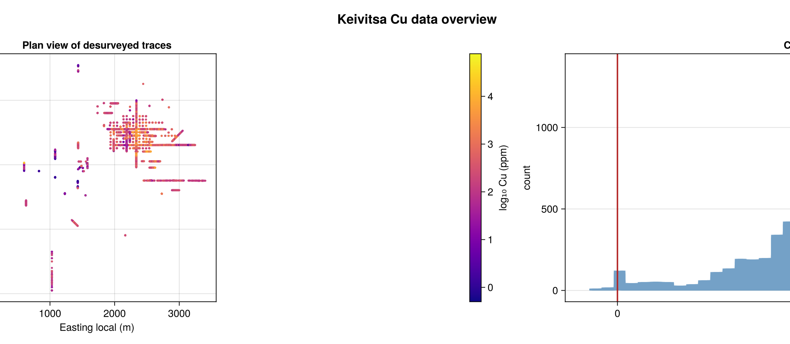

*Plan view of the desurveyed Cu holes coloured by log10 Cu, and the log10 Cu distribution with the 1 ppm detection limit.*

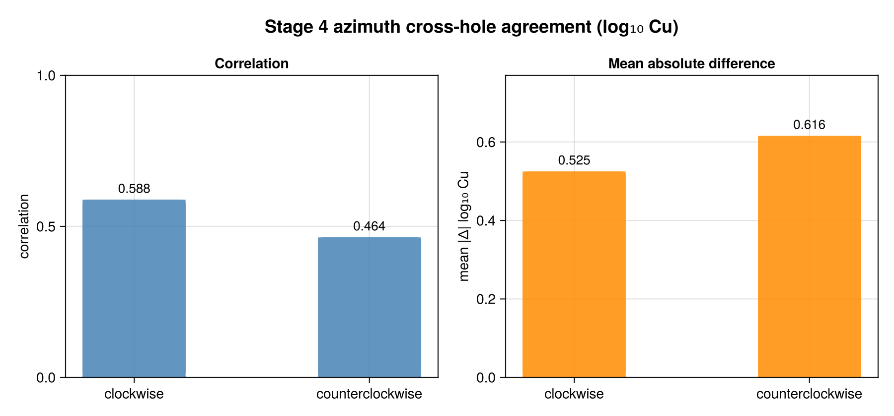

*Cross-hole agreement of log10 Cu for inclined, non-N–S holes (nearest sample from another hole within 20 m): clockwise azimuth gives correlation 0.588 and mean |Δ| 0.525; counterclockwise 0.464 and 0.616. An independent Python check gives the same values.*

## Method

The same folds score four predictors: the training mean, kriging (v1), `nn_xyz` (coordinates only: x, y, z with Fourier features), and `nn_cov` (coordinates plus `depth_below_surface`). Keivitsa has no structure distance or surface geology. Skill is `1 − RMSE / RMSE_mean`, with RMSE pooled over test samples and the mean taken from that fold's training holes.

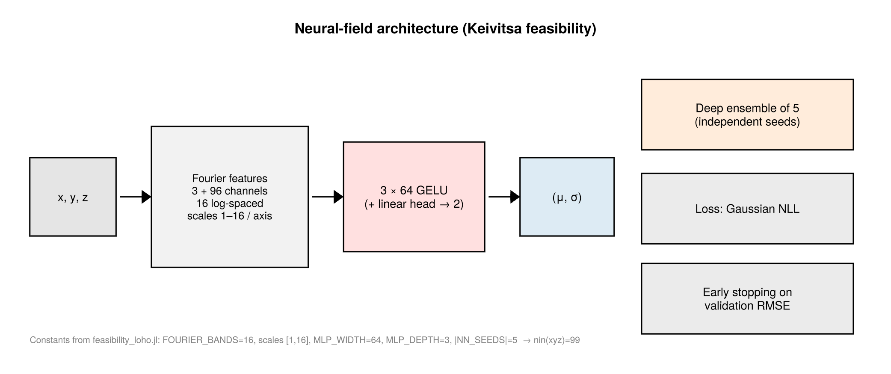

*Fourier features of xyz (16 bands), a 3 × 64 GELU MLP, and a head for μ and softplus σ. Five seeds; predictive variance is the mean of σ² plus the variance of the member means.*

`nn_cov` pooled skill is 0.152, essentially the same as `nn_xyz`. The block model and the figures below use `nn_xyz`.

## Training diagnosis

Stopping was chosen on a synthetic Cu field at the real hole locations, before the real-Cu cross-validation was run (the 30-hole pilot's real-Cu skills had been seen).

Stopping on validation NLL (E0) halted at a median of 39 steps (validation skill 0.205, synthetic test skill 0.258, against kriging test skill 0.331). The pre-set rule on that synthetic table picked E0. E2 — same NLL loss, stop on validation RMSE of μ — was frozen instead, as a recorded deviation: median best step 272, validation skill 0.519, synthetic test skill 0.411.

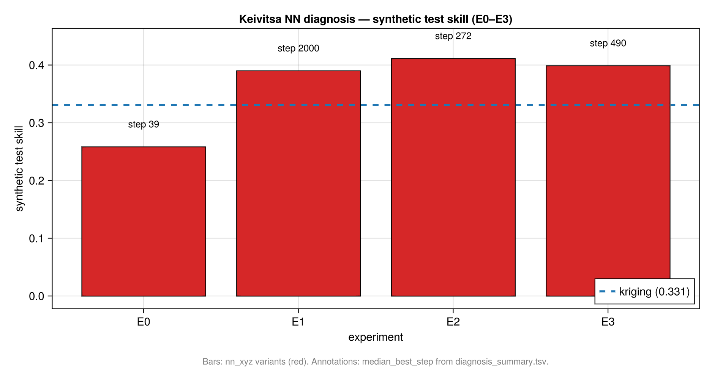

*Synthetic diagnosis only. E0 underfits μ. E2 is the frozen real-Cu setting.*

On the real final model (`stop_on = :val_rmse`, five seeds) the best steps are 13, 16, 19, 21, and 19. Validation RMSE there is 0.847–0.886, and at step 50 it is 0.900–0.948. Longer training fits noise. The smooth 3D field reflects what the data support: training longer only fits noise.

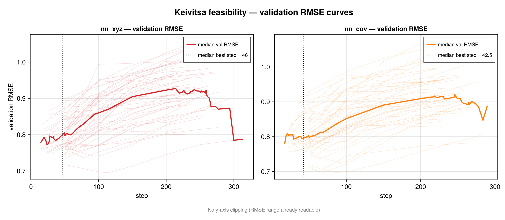

*Validation RMSE of μ. The restored step is the minimum; step 50 is already worse.*

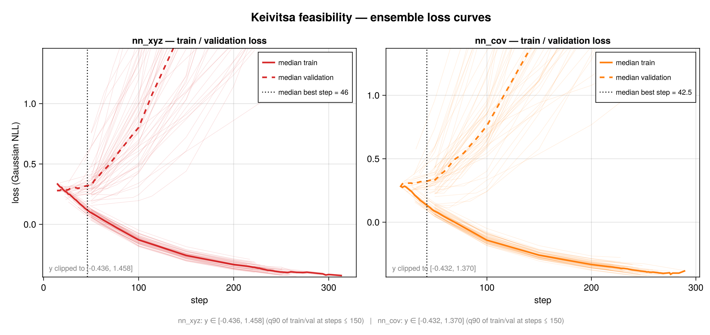

*Validation loss is lowest around steps 20–110 and then rises while training loss keeps falling. Restoring the best weights is why the intervals cover.*

## Results

Pooled RMSE is 0.767 (mean), 0.686 (kriging v1), and 0.651 (`nn_xyz`).

The **pooled difference** is one skill on all test samples minus the other: +0.045, with a hole-bootstrap 95 % CI of −0.024 … 0.133. The interval includes 0, so the samples do not show a significant gain.

The **per-hole paired mean** is the average, over 261 holes, of that hole's skill minus kriging's skill on the same hole: +0.061 (0.005 … 0.116). That interval excludes 0. The network wins on 130 of 261 holes. A small per-hole edge is not the same claim as a significant pooled-skill gain.

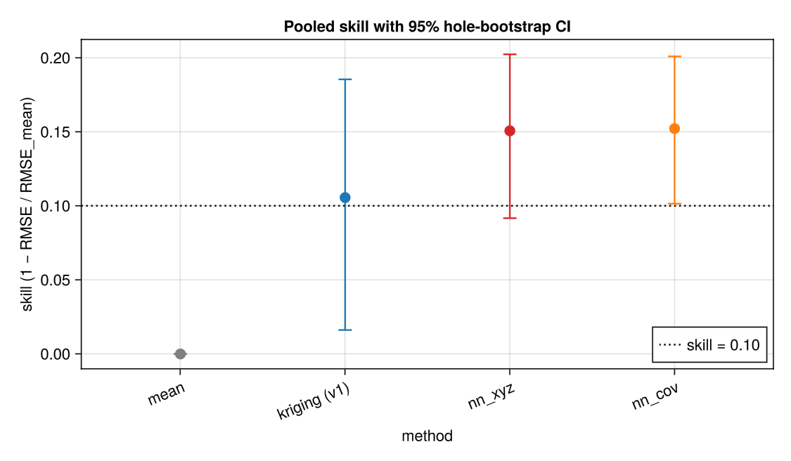

*Pooled skill. Both neural fields clear 0.10; their intervals overlap kriging (v1).*

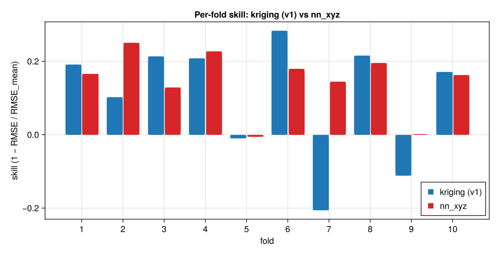

*The ranking is not the same in every fold. Kriging (v1) wins some folds; the network wins others.*

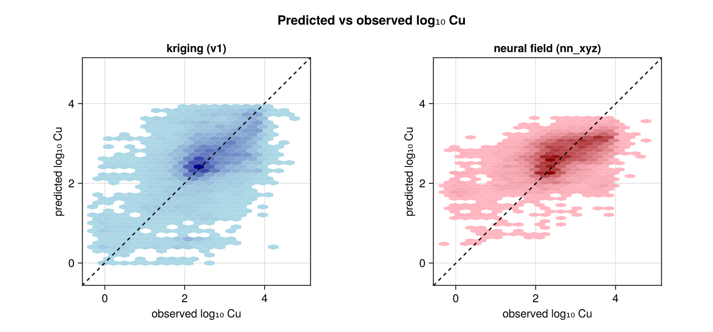

*Held-out log10 Cu. Kriging (v1) tracks short-scale spikes; the neural field stays closer to the cloud's trend.*

## Uncertainty

For a calibrated Gaussian, the median of σ / |error| is about 1.48. The neural field's median is 1.38; kriging (v1) is 0.58. Kriging (v1)'s 90 % intervals miss about half of the held-out samples.

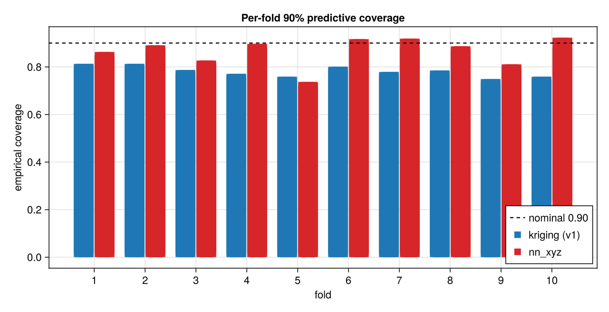

*Nominal coverage is 0.90. The neural field stays in 0.74–0.92; kriging (v1) stays in 0.43–0.54.*

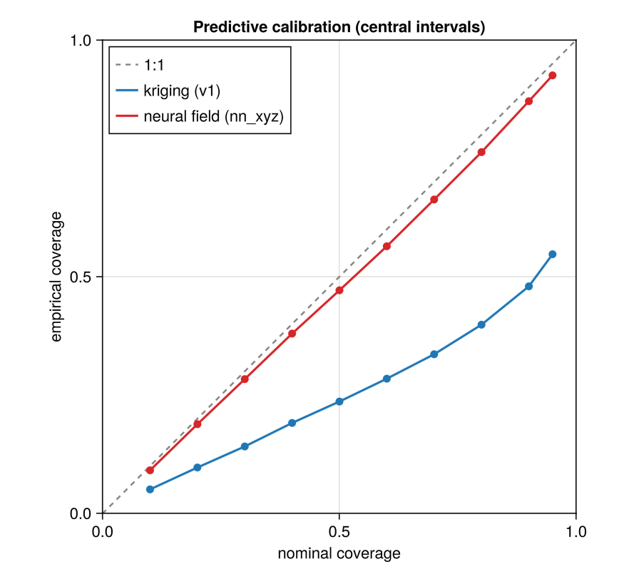

*Observed frequency against nominal interval level. The neural field follows the diagonal; kriging (v1) falls below it.*

## 3D and section

The displayed block model keeps 80,761 cells inside 60 m of a sample, out of 2,969,400 cells on a 20 m × 20 m × 10 m grid. It is a full five-seed E2 fit on 209 holes, with 52 holes held out only for the stopping set (best steps as above). Wall clock was 262 s.

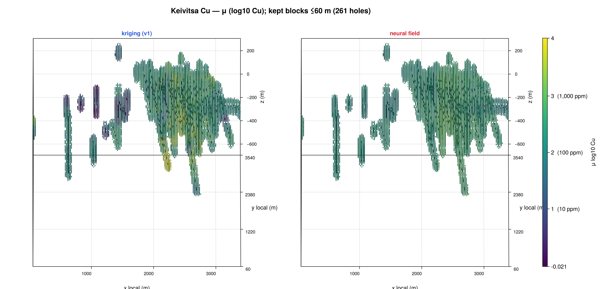

*log10 Cu. Kriging (v1) is locally detailed. The neural field follows the large-scale trend.*

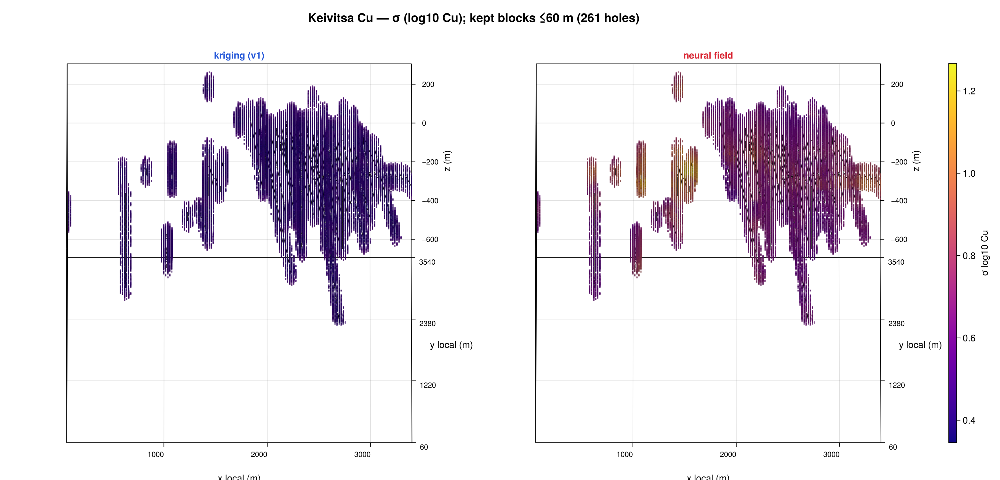

*Kriging (v1) σ is about 0.15–0.2 almost everywhere. Neural-field σ is larger and higher around isolated holes and near the surface, which matches the coverage gap.*

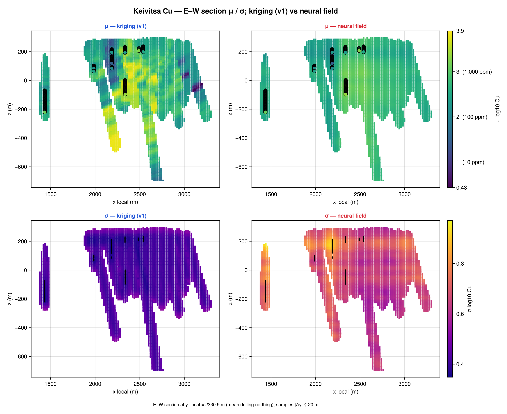

*Same contrast on one section: a sharp kriging (v1) mean with a flat σ, and a smoother neural mean with a structured σ.*

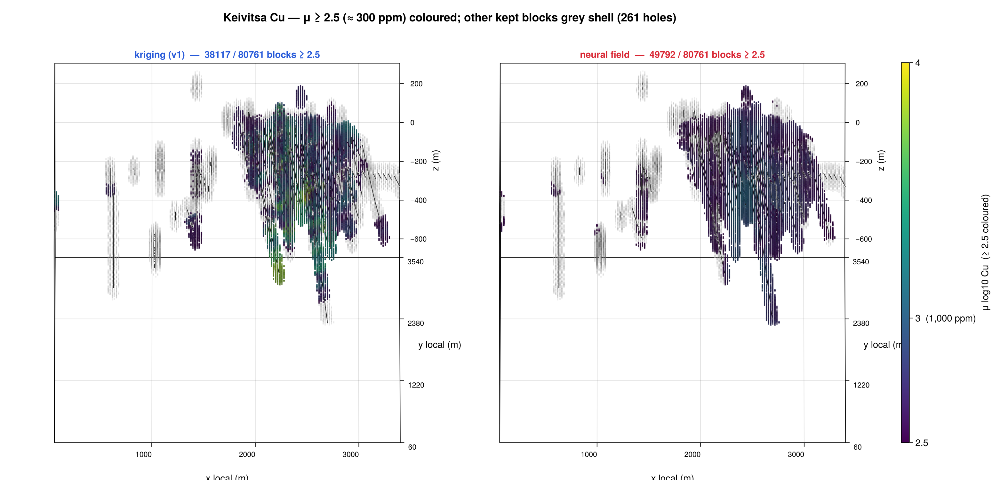

*Blocks with μ ≥ 2.5 (≈ 300 ppm): kriging (v1) 38,117, neural field 49,792 of 80,761. Smoothing pulls estimates towards the mean, which inflates the count just above a threshold near the mean, more so for the smoother model. Not a resource estimate.*

## Kriging (v1) limitations

The baseline is an anisotropic spherical variogram with one shared sill, refit on each fold's training holes. On fold 6 the vertical range is 972 m, which is the optimiser's upper bound (twice the last downhole bin centre). Eight of the ten folds sit on that same bound. Downhole bins are 33 m wide, so they cannot resolve a 2 m nugget.

The comparison is therefore with kriging (v1). A variogram that can place a short-scale nugget and a free vertical range — kriging (v2) — is the next baseline, not a result claimed here.

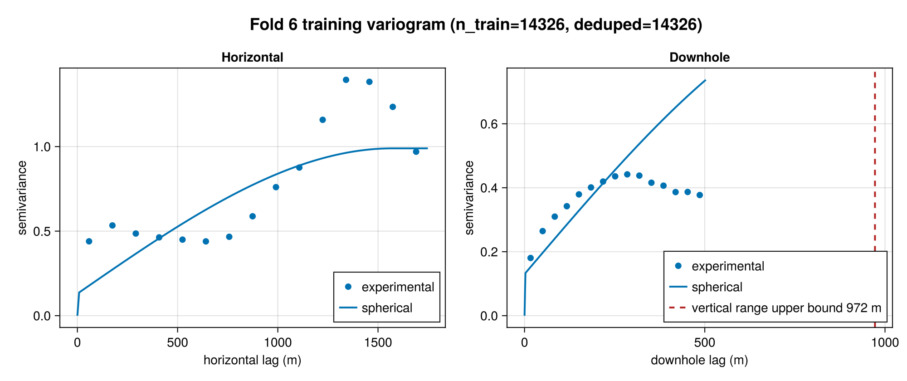

*Within the 503 m lag window the downhole experimental semivariance levels off, while the fitted curve keeps rising because its vertical range is pinned at the 972 m upper bound.*

## Reproducibility

`examples/keivitsa_run2_checks.jl` compared `summary.tsv`, `paired.tsv`, and `decision.tsv` from the clean rerun with the previously reported tables. The three files are byte-identical.

`examples/feasibility_keivitsa.jl` claims the work directory before training. It refuses to start if that directory already contains files, and it refuses to start if `.run.lock` is present, so a second process cannot write the same folder.

## Open work

- Kriging (v2): a nugget the 33 m bins can see, and a vertical range that is not pinned at 972 m.
- Density and magnetic susceptibility on the same hole-grouped folds.
- Spatial-block cross-validation, not only hole groups.
- Hole thinning, to see how skill changes as spacing approaches the Cloncurry regime.
- Geophysical covariates that are known away from the drills.
