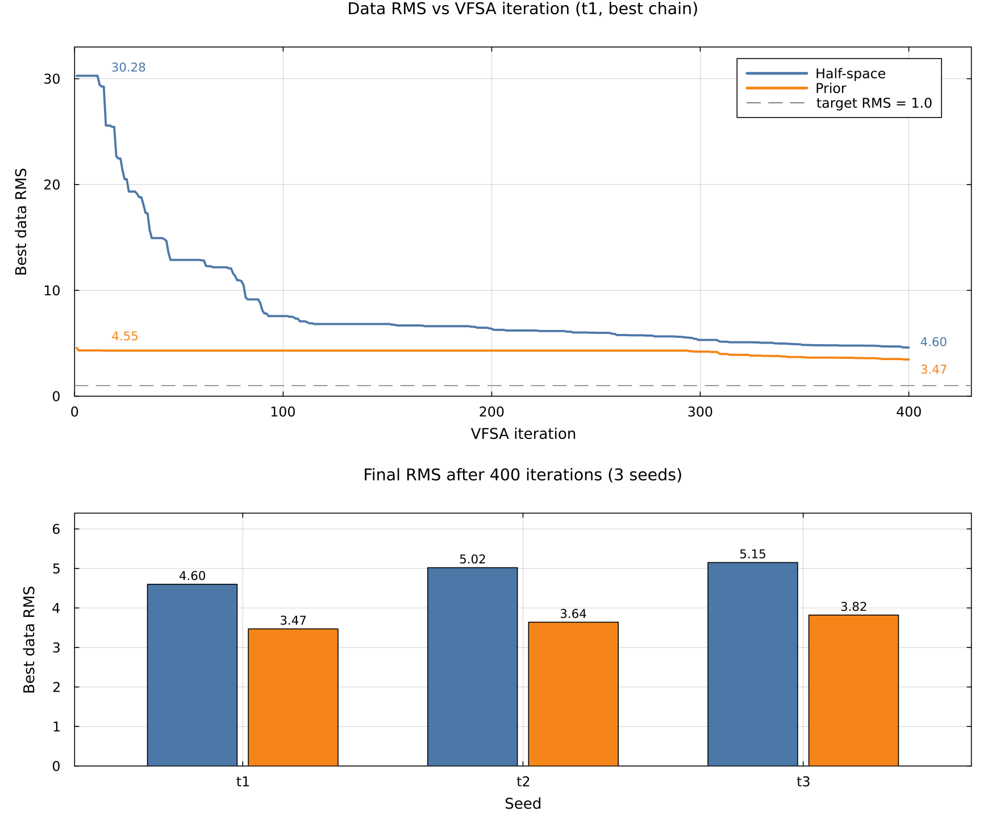
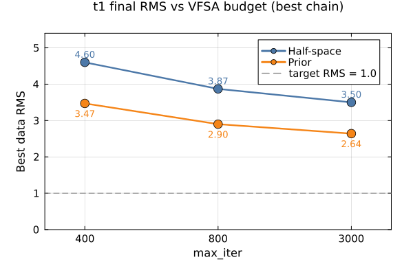

# SmartPriorMT — Ara Rapor

**Kime:** bilgisayar mühendisi (jeofizik varsayılmaz)
**Ne:** 2B manyetotellürik (MT) ters çözümü için öğrenilmiş **warm-start prior**
**Sürüm:** 0.1.0 · Julia 1.10 · Lux.jl + Zygote + MTGeophysics 0.5.0
**Tarih:** 15 Eylül 2026
**Kaynak:** 3-seed VFSA `tmp_verify_compare_t{1,2,3}` (best chain, 14 Eylül);
bütçe t1 `tmp_verify_compare_t1_iter{800,3000}`; jeoloji sweep
`tmp_verify_scenario_sweep`; misspec gravite `tmp_verify_robust`;
blind/best-case `tmp_blind_t{1,2,3}`, `tmp_bestcase_t1`; ablasyon
`tmp_ablation`; Musgrave `tmp_musgrave`, `tmp_musgrave_coarse`.
Sayılar ilgili `Summary.md` / `metrics.txt` / koşu loglarından.
Eski `tmp_*_v2` VFSA satırları (yalnızca chain 1) bu tablolarla
**karıştırılmamalı**.

Bu bir **joint inversion değildir.** Füzyon yalnızca başlangıç modeli üretilirken olur; VFSA çözücüsüne dokunulmaz.

---

## 1. Problem (optimizasyon dili)

MT ters çözümü, yeraltının hücre-hücre log₁₀ özdirencini (`μ`) gözlenen elektromanyetik eğrilerden kestiren **kötü-konumlu (ill-posed)** bir ters problemdir. Kullanılan çözücü **VFSA** (Very Fast Simulated Annealing): stokastik, çok-başlangıçlı bir arama.

Bugünkü pratik: aramayı **homojen yarı-uzaydan** (her hücre aynı `ρ`) başlatmak. Bu, eğimli bir iletken gibi yanal yapıda pahalıdır — ilk ileri çözümün veri uyumsuzluğu (data RMS) ~30 civarındadır ve bütçenin çoğu “neredeyse doğru yere gelmeye” harcanır.

**Hedef:** aynı VFSA’yı, aynı seed ve aynı bütçeyle, ama daha iyi bir başlangıçtan çalıştırmak.

```
girdi  →  öğrenilmiş hücre-bazlı (μ, σ)  →  VFSA warm-start  →  özdirenç modeli
```

Ağın truth’u görmediği bir sentetikte, 3 bağımsız seed ile:

| | yarı-uzay | smart prior | ayrım |
|---|---:|---:|---|
| **data RMS, iter 1** | 30.259 ± 0.019 | 4.591 ± 0.054 | stokastik değil |
| **data RMS, iter 400** | 4.920 ± 0.287 | 3.641 ± 0.175 | aralıklar örtüşmüyor |

Iter 1 farkı stokastik değil: iki farklı başlangıç modelinin ileri çözümüdür.
400. iterasyonda da prior 3/3 seed’de daha düşük data RMS’te biter (~%25).
`target_rms = 1.0` bu bütçeyle (ve 3000 iterasyonda da) ulaşılmaz — §4.4.

---

## 2. Girdi → çıktı

### 2.1 Sistem sınırı

| | İçerik |
|---|---|
| **Girdi** | Gravite anomalisi (mGal) + MT eğrileri (görünür özdirenç, faz) + isteğe bağlı topo |
| **Çıktı** | Hücre-bazlı nominal log₁₀ ρ (`μ`) ve güven (`σ`); VFSA’ya başlangıç modeli + arama aralığı `μ ± kσ` |
| **Değiştirilmez** | VFSA’nın ileri fiziği, pertürbasyon, soğuma çizelgesi |
| **Etiket yok** | Yeraltı truth’u eğitimde yok. Kayıp, diferansiyellenebilir fizik terimleri. |

### 2.2 Veri yolu (sentetik doğrulama)

Aynı mesh, aynı gürültülü gözlem, iki kolda yalnızca başlangıç değişir.

```
1. Truth          1×56×22 grid (1232 hücre). Host log₁₀ρ = 2.6;
                  eğimli iletken slab (35°, log₁₀ρ = 0.6, Δρ = 350 kg/m³).
2. MT gözlemi     2B sonlu-hacim çözücü + gürültü. 15 istasyon, 14 periyot.
                  Prior bu eğrileri görür; truth’u görmez.
3. Gravite        Kapalı-form prizma operatörü + 0.1 mGal gürültü.
                  37 istasyon. Slab yoğunluğu özdirençten türetilmez.
4. NB baseline    Gözlenen MT’nin Niblett-Bostick dönüşümü (derinlik tahmini).
5. FeatureStack   14 kanal → Fourier kodlama → X ∈ ℝ^{38×1232}
6. PriorNet       Lux MLP, residual-mode (NB’ye düzeltme öğrenir).
                  5 üyeli ensemble, 3000 epoch, Zygote AD.
7. PriorBundle    (μ, σ) → start_prior.rho
8. VFSA × 2       Aynı seed, 2 zincir, 250 kontrol, 400 iter (t1 bütçe
                  taramasında 800 ve 3000; ablasyonda 1200).
                  Kol A: yarı-uzay. Kol D: prior.
```

2B profilde `x_norm` ve `gravity_dx` tanım gereği sıfır → efektif **12 kanal**. “14 kanal” demek yanıltıcı.

### 2.3 Ağ ve kayıp

```
hücre özellikleri  →  MLP (genişlik 96, derinlik 4, GELU)
                   →  residual  (NB baseline’a eklenir, span = 2.5 dekât)
                   →  μ ∈ [0, 4]   (log₁₀ ρ, hard bound)
                   →  σ ∈ [0.05, 0.9]
```

Kayıp terimleri (hepsi AD-güvenli, etiketsiz):

| Terim | Ne ölçer | Operatör |
|---|---|---|
| gravite | yüzey anomalisi | kapalı-form prizma (`A · density(μ)`) |
| MT kolon | istasyon kolonunun 1B empedansı | generic 1B resürsiyon (Zygote) |
| smoothness | uzaysal pürüzlülük | grid Laplacian |
| sigma | hücre-bazlı `σ` hedefi | MT kolon artığı + gravite duyarlılığı (`SigmaDriveConfig`); AD dışında, her epoch |
| reference | NB’den sapma maliyeti | ablasyon / Musgrave’de ağırlık 0.1 |

`density = 100 · (slope · (μ − ref) + offset)`. `slope` öğrenilir, işaret sınırı `(-4, −0.2)`: bu sentetikte yoğun cisim iletkendir.

### 2.4 Dosya girdi/çıktı

| Aşama | Girdi | Çıktı |
|---|---|---|
| eğitim | `GravityObs`, `MTSites`, grid | `prior.jld2` (Lux parametreleri) |
| export | ensemble + `X` | `prior.rho`, `prior.lo`, `prior.hi` |
| VFSA | `start_*.rho` + `data.obs` | `model.mean`, `model.median`, `Summary.md`, RMS zinciri |
| skor | truth + iki sonuç | `metrics.txt` (RMSE, korelasyon, RMS@1, RMS@400) |

Çalıştırma: `julia --project=. examples/compare_prior_2d.jl`

---

## 3. Ne iddia ediyoruz, ne etmiyoruz

**Ayakta:** prior, VFSA’yı ~7× daha düşük ilk misfit’ten başlatır; 400
iterasyonda da daha düşük data RMS’te biter (3/3 seed, best chain).

**Ayakta, dar jeoloji:** sığ–orta eğimli, yoğun=iletken slab’de prior, NB
baseline’ından daha yüksek korelasyon verir (15° ve yayımlanan 35°).

**Çürütülen:** “prior daha dik slab üretir.” Eğim farkının işareti seed’e göre değişiyor. Bu iddiayı kurmayın.

**Çürütülen:** “kazanç her geometride duruyor.” 55° dik eğimde prior NB’den
kötü (corr kazancı −0.074). Ters polaritede (yoğun+dirençli) RMSE NB’nin
üzerinde.

**Kanıtlanamadı:** gerçek sahada (Musgrave) prior’ın nihai yeraltı modelinin yarı-uzaydan daha doğru olduğu — truth yok.

**Darboğaz:** sentetikte `target_rms = 1.0` 3000 iterasyonda da kapanmıyor.
Kalan fark `max_iter` değil, RBF parametrizasyonu (`n_ctrl = 250`).

---

## 4. Sentetik — 3 seed (ayakta duran tablo)

Aynı deney, üç bağımsız `(MT, train, VFSA, gravite)` seed’i.
Kaynak: `tmp_verify_compare_t{1,2,3}` (14 Eylül 2026). VFSA satırları **best
chain** (`Summary.md` `best_chain_rms`). Std örnek (`n−1`).
`SigmaDriveConfig` açık.

| metrik | t1 | t2 | t3 | **ort ± std** |
|---|---:|---:|---:|---:|
| NB RMSE (log₁₀ ρ) | 0.556 | 0.547 | 0.551 | **0.551 ± 0.005** |
| prior RMSE | 0.544 | 0.554 | 0.539 | **0.546 ± 0.008** |
| NB korelasyon | 0.426 | 0.430 | 0.429 | **0.428 ± 0.002** |
| prior korelasyon | 0.438 | 0.440 | 0.453 | **0.444 ± 0.008** |
| yarı-uzay RMS iter 1 | 30.278 | 30.240 | 30.261 | **30.259 ± 0.019** |
| prior RMS iter 1 | 4.553 | 4.566 | 4.653 | **4.591 ± 0.054** |
| yarı-uzay RMS iter 400 | 4.598 | 5.018 | 5.145 | **4.920 ± 0.287** |
| prior RMS iter 400 | 3.467 | 3.640 | 3.816 | **3.641 ± 0.175** |

Okuma notu:

- Prior ham RMSE, NB baseline’ı **kesin geçmiyor** (aralıklar örtüşüyor). Kazanç korelasyonda: 0.444 vs 0.428, aralıklar örtüşmüyor.
- Data RMS, model RMSE değildir. VFSA veriye uyar; truth’a RMSE’nin iterasyon boyunca bozulması beklenen bir durum olabilir (gürültüye uydurma).
- Eski `tmp_*_v2` tablosu yalnızca chain 1 idi (t2 yarı-uzay 5.242, prior 4.122). Best chain t2’yi 5.018 / 3.640 yapar; README ile aynı.
- `σ`: t1’de `mean(σ) = 0.376`, `corr(σ, |μ−truth|) = +0.368`. Bu, eski düzgün-σ koşusundaki `corr(σ, |residual|) = +0.09` ile **aynı ölçüm değil**. `σ` hâlâ kalibre belirsizlik haritası değil ve VFSA’ya girmez.

### 4.1 Best-case vs blind hiperparametre (model uzayı)

İki ayrı tablo — karıştırmayın. Aynı 3 seed (`t1/t2/t3` seed seti), eğitim-only
(`examples/train_prior_blind.jl`), VFSA yok. Fark yalnızca `residual_span` ve
`slope_bounds`. §4 ana tablosundaki VFSA satırlarıyla karıştırmayın.

**Protokol (truth’suz, sahaya taşınabilir):**

| hiperparametre | best-case | blind |
|---|---|---|
| `residual_span` | 2.5 | `residual_span_half_band(log_rho_bounds)` = 2.0 |
| `slope_bounds` | `(-4, −0.2)` | `(-10, −0.1)` |
| işaret gerekçesi | sentetik tasarım (yoğun=iletken slab) — dışsal varsayım | aynı; büyüklük geniş tutucu bant |

`residual_span_from_baseline` (`k·σ_lat`, Features.jl) aynı kodla hesaplanır; bu
sentetikte `σ_lat ≈ 0.17` → k=3 ile floor=1.0’a oturur. Blind koşu half_band’i
kullanır (izin verici). Musgrave örnekleri de aynı half_band kuralını çağırır.

#### Best-case — yöntemin üst sınırı (uygun hiperparametrelerle)

Yayımlanan best-case prior satırları (eğitim-only). Eşleşmiş yeniden-koşu
(`SMARTPRIOR_PROTOCOL=bestcase`, aynı kod + `SigmaDriveConfig`): t1 RMSE 0.544 /
corr 0.438 — §4 t1 ile pratik olarak aynı; σ-drive bu karşılaştırmayı
bozmuyor.

| metrik | t1 | t2 | t3 | **ort ± std** |
|---|---:|---:|---:|---:|
| prior RMSE | 0.546 | 0.554 | 0.539 | **0.546 ± 0.008** |
| prior korelasyon | 0.438 | 0.439 | 0.453 | **0.443 ± 0.008** |

#### Blind — gerçekçi, truth-bağımsız protokol

Kaynak: `tmp_blind_t1`–`t3` (`SMARTPRIOR_PROTOCOL=blind`).

| metrik | t1 | t2 | t3 | **ort ± std** |
|---|---:|---:|---:|---:|
| prior RMSE | 0.517 | 0.520 | 0.515 | **0.518 ± 0.003** |
| prior korelasyon | 0.498 | 0.497 | 0.509 | **0.501 ± 0.007** |

**Bulgu:** Blind, best-case’i bozmuyor — model-uzayı RMSE/korelasyon **daha iyi**
(RMSE −0.029, corr +0.058 ort.). Kazanım oracle hiperparametreye bağlı değildi;
tersine, dar `(-4, −0.2)` bandı ve/veya span=2.5 bu metriklerde üst sınır değil.
NB’ye göre corr kazanımı korunuyor (blind 0.501 vs NB 0.429). Bu, leakage
endişesini “kritik”ten “hafif”e indirir (ortadan kaldırmaz: işaret hâlâ dışsal
varsayım).

Duyarlılık taraması: `examples/train_prior_sensitivity.jl`
(`residual_span ∈ {1.0…5.0}` × üç slope genişliği). Beklenen şekil: geniş plato,
2.5’te keskin tepe değil — koşu sonuçları eklenecek.

### 4.2 Görsel: aynı bütçe, iki başlangıç

t1, best chain, **aynı eksen** (tablo değerleri annotasyonlu):



Seed 3 ensemble mean (yapı karşılaştırması; eski yakınsama panelleri ayrı
eksen ölçeği kullandığı için overlay’e taşındı):


### 4.3 VFSA sonrası model uzayı (truth’a)

Data RMS ≠ truth RMSE. Aynı 3 seed, VFSA sonrası `model.mean` vs truth.
Kaynak: `tmp_verify_logs/compare_t{1,2,3}.log`.

| seed | yarı-uzay RMSE | prior RMSE | yarı-uzay corr | prior corr |
|---|---:|---:|---:|---:|
| t1 | 0.654 | **0.620** | 0.205 | **0.304** |
| t2 | 0.569 | **0.554** | 0.341 | **0.402** |
| t3 | **0.558** | 0.566 | 0.331 | **0.402** |

Korelasyon 3/3 seed’de prior’da daha yüksek. RMSE tutarsız — t3’te yarı-uzay
truth’a daha yakın. Yapı (nerede iletken/dirençli) daha iyi yakalanıyor;
mutlak genlikte garanti yok.

### 4.4 Bütçe 400 → 800 → 3000 (t1, best chain)

`target_rms = 1.0`. Üç **ayrı** koşu; soğuma `cool_ratio = 0.001` bütçeye
göre ölçeklenir — 3000’lik koşunun 400. iterasyonu, 400’lük koşunun sonu
değildir.

| `max_iter` | prior | yarı-uzay | kaynak |
|---:|---:|---:|---|
| 400 | 3.467 | 4.598 | `tmp_verify_compare_t1` |
| 800 | 2.904 | 3.869 | `tmp_verify_compare_t1_iter800` |
| 3000 | **2.641** | **3.503** | `tmp_verify_compare_t1_iter3000` |



- 400 kısa bütçeydi, plato değildi: 800’e inince her iki kol da düşer.
- 800 → 3000 (5.5× iterasyon) umulan kazancın yarısından azını verir.
  Son 200 iterasyonda RMSBest eğimi yarı-uzay −0.00039/iter, prior
  −0.00043/iter; kabul oranı %9.0 / %7.5 — soğuk rejimde arama neredeyse durmuş.
- Kalan ~1.6 RMS `max_iter` ile kapanmıyor. Aday: RBF parametrizasyonu
  (`n_ctrl = 250`, çekirdek ~800–1000 m). `step_scale` darboğaz değildi.
- Prior, yarı-uzayı geçmeye devam eder (2.641 vs 3.503); bu başlangıç
  avantajıdır, arama artefaktı değil. Yarı-uzay daha fazla bütçeyle yaklaşır,
  geçmez.

### 4.5 Jeoloji sweep (VFSA yok — prior vs NB)

Kaynak: `tmp_verify_scenario_sweep/sweep_metrics.tsv` (3000 epoch, 5 üye).
`dip35_conductive_published` satırı RMSE 0.544 / corr 0.438 ile §4 t1’e
oturuyor — pipeline sapmamış.

| senaryo | eğim | NB RMSE | NB corr | prior RMSE | prior corr | kazanç (corr) |
|---|---:|---:|---:|---:|---:|---:|
| dip15_conductive | 15° | 0.716 | 0.489 | 0.423 | 0.741 | **+0.252** |
| dip35_conductive_published | 35° | 0.556 | 0.426 | 0.544 | 0.438 | +0.011 |
| dip55_conductive | 55° | 0.477 | 0.391 | 0.557 | 0.317 | **−0.074** |
| dip35_resistive | 35° | 0.264 | 0.255 | 0.338 | 0.274 | +0.019 |

`dip35_resistive` kontrastı 1.2 dekat (diğerleri 2.0); RMSE’yi diğerleriyle
doğrudan kıyaslamayın, kendi NB’sine göre okuyun.

- **15°:** net kazanç. **35° yayımlanan:** küçük ama pozitif corr kazancı.
- **55°:** prior NB’den kötü. Scout (400 epoch, 1 üye) −0.018 idi; tam eğitim
  −0.074 — “az eğitildi” değil.
- **Ters polarite:** corr kazancı +0.019; prior RMSE (0.338) NB’nin (0.264)
  üzerinde. “Kazandırıyor” denemez.

dip55 ayırt edici (tek senaryo, tam eğitim):

| koşu | smooth | reference | kazanç (corr) |
|---|---:|---:|---:|
| taban | 10.0 | 0.0 | −0.074 |
| yumuşaklık gevşetildi | 1.0 | 0.0 | −0.137 |
| residual cezalandı | 10.0 | 0.3 | −0.071 |

İki düzenlileştirme hipotezi de elendi. Kalan aday: dik eğimde yüzey izi
daralır, sabit istasyon aralığı (500–1000 m) yeterince örneklemez. NB’nin
kendi korelasyonu da eğimle düşer (0.489 → 0.426 → 0.391) — ağa özgü değil.

**İddia sınırı:** 15°–35°, yoğun=iletken. Dışında kazanç yok veya negatif.
Bu sweep VFSA yakınsama hızını ölçmez.

### 4.6 Misspec gravite (tek seed, t1 seed seti)

Kaynak: `tmp_verify_robust`. Yoğunluk alanına MT’nin görmediği küçük ölçekli
heterojenlik (`HETERO_STD_FRAC = 0.075` × 350 kg/m³). Koşu inversiyon
skorundan sonra `BoundedCore` hatasıyla kesildi; aşağıdaki sayılar log’daki
`inversion outcome` bloğundan.

| | yarı-uzay | prior |
|---|---:|---:|
| data RMS (best chain) | 4.598 | **3.075** |
| model RMSE start | 0.456 | 0.524 |
| model RMSE after | 0.654 | **0.605** |
| corr after | 0.205 | **0.322** |

Prior başlangıç RMSE 0.524 / corr 0.449 — yayımlanan bozulmamış t1
(0.547 / 0.438) bu perturbasyonda kötüleşmedi. Tek seed; 3-seed tablosuyla
karıştırmayın.

---

## 5. Ablasyon — ağ gerçekten bir şey katıyor mu?

Aynı sentetik veri, aynı VFSA (`max_iter = 1200`, 2 zincir). Dört başlangıç. **Tek seed** — 3-seed tablosuyla karıştırmayın.

| kol | başlangıç | eğitim | gravite |
|---|---|---|---|
| **A** | homojen yarı-uzay | yok | yok |
| **B** | Niblett-Bostick (bedava) | yok | yok |
| **C** | NB + kapalı-form damped LS gravite + sabit eğim −2.1 | yok | doğrusal |
| **D** | PriorNet ensemble (`reference = 0.1`) | 3000 epoch × 5 üye | öğrenilen eğim |

### 5.1 Model uzayı (truth’a log₁₀ ρ RMSE)

| | A yarı-uzay | B NB | C NB+doğrusal | D tam prior |
|---|---:|---:|---:|---:|
| başlangıç RMSE | 0.456 | 0.556 | 0.572 | **0.547** |
| VFSA sonrası RMSE | 0.645 | 0.632 | 0.617 | **0.574** |
| son korelasyon | 0.263 | 0.316 | 0.299 | **0.376** |

C, B’den kötü başlıyor (sabit eğim + LS, derinlik körü). D, C’ye göre VFSA sonrası RMSE’de **0.042** kazanç (C’nin %6.8’i) — eşik `0.02 · RMSE_C` üstünde; ağın doğrusal düzeltmeye katkısı bu senaryoda ölçülebilir.

### 5.2 Data RMS (VFSA best chain)

| | A | B | C | D |
|---|---:|---:|---:|---:|
| best-chain RMS | 3.693 | 3.258 | 3.448 | **2.753** |
| ensemble-mean RMS | 4.318 | 3.589 | 3.519 | **2.919** |

Üst satır başlangıç, alt satır VFSA sonucu:


Yalnızca VFSA sonuçları:


---

## 6. Gerçek veri — Musgrave (AusLAMP, truth yok)

Truth olmadığı için “daha doğru model” iddia edilemez. Ölçülen şey **veriye uyum hızı**.

### 6.1 Nominal çözünürlük (`tmp_musgrave`, 400 iter, erken durma kapalı)

| iter | yarı-uzay best RMS | prior best RMS |
|---:|---:|---:|
| 1 | 2.373 | **1.057** |
| 5 | 2.056 | **0.970** (hedef 1.0’ın altı) |
| 10 | 1.804 | **0.911** (plato) |
| 100 | 1.174 | 0.911 |
| 400 | 1.040 | **0.911** |

Prior 5. iterasyonda 1.0’ın altına iner. Plato (0.911) arama tıkanıklığı değil: VFSA RMS = √(χ²/N), `inv_prior/data.obs` TE-only ZXY ile N=414, χ²/datum=1 tam RMS=1. Log: 343.8849 / 0.911394² = 414. `model_err_frac=0.4` donmuş (`RealDataIO.jl`; medyan σ/|Z|=0.400); 0.911 tabanın biraz altında (hafif konservatif bütçe). Yarı-uzay 1.040 tabanın hemen üstünde. Gravite `model_err_mgal=15` bu RMS’e girmez. `target_rms=0.1` bu bütçeyle ulaşılamaz.


Yakınsama (log’dan, VFSA yeniden koşulmadı):


### 6.2 Kaba ağ (20 km hücre) — negatif sonuç

| | yarı-uzay | prior |
|---|---:|---:|
| iter 1 | **2.640** | 2.663 |
| iter 400 | **2.299** | 2.497 |

Bu çözünürlükte prior **daha kötü**. Mesh seçimi henüz taranmadı.


---

## 7. Yazılım yığını (sunum için)

```
Grid.jl / Features.jl     ızgara + 14 kanal (efektif 12)
Gravity.jl                AD-güvenli prizma operatörü
MT1DAD.jl                 Zygote-uyumlu 1B MT (upstream Float64 cast’i atlar)
PriorNet.jl               Lux koordinat-ağı, Fourier özellik, residual-mode
Losses.jl / Train.jl      fizik kaybı + ensemble
Export.jl                 WS3D / MTGeophysics I/O
Profile2D.jl              2B sürücü
```

`src/` ~14 modül. Test: 13 dosya. Bağımlılık pin’li (`Project.toml` compat).

**Ters suç (beyan):** sentetik gravite `gravity_matrix` ile üretilir — operatör-düzeyinde ters suç var, petrofizik yok (slab 350 kg/m³ `density_from_mu`’dan geçmez). MT tarafında yok: gözlem 2B sonlu hacim, eğitim terimi 1B.

**Kapsam dışı:** 3B (`BoundedVFSA.jl` yazıldı, çalıştırılmadı), TM kip.

---

## 8. Sınırlamalar (iddia etmeyin)

1. Tek küresel gravite–özdirenç eğimi → tek baskın litoloji. Karışık litolojide (Musgrave: dirençli kütle + iletken fay) zorlanır.
2. TE-only.
3. `σ` likelihood ile fit edilmez (anchor yok). `SigmaDriveConfig` MT kolon artığı + gravite duyarlılığından hedef harita üretir; `sigma_penalty` onu izler. §4 koşularında `mean(σ) ≈ 0.38`, `corr(σ, |μ−truth|) ≈ +0.3`; kalibre belirsizlik haritası değil ve VFSA’ya girmez.
4. Gravite derinlik körü: tek 2B harita her kata kopyalanır.
5. `RealDataIO.jl` Musgrave’e özgü.
6. Slab eğimi iddiası **geri çekildi**.
7. `slope_bounds` işareti dışsal jeolojik/tasarım varsayımıdır (veri-türevi değil).
   Büyüklük için truth-bağımsız tutucu bant: sentetik blind `(-10, −0.1)`,
   Musgrave `(0, 1.5)`. `residual_span` için half_band / `from_baseline` protokolü
   (§4.1); yayımlanan span=2.5 best-case üst sınırdır.
8. Kazanç jeolojiye bağlı: 55° dik eğimde ve ters polaritede prior NB’yi geçmez (§4.5). Sweep VFSA hızını ölçmez.
9. Sentetikte `target_rms = 1.0` 3000 iterasyonda da ulaşılmaz; darboğaz RBF (`n_ctrl = 250`), `max_iter` değil (§4.4).

---

## 9. Sunum sırası (öneri)

1. Kötü-konumlu arama + warm-start (bu sayfa, §1).
2. Girdi/çıktı kutusu (§2) — “joint inversion değil.”
3. Iter 1 / iter 400 RMS tablosu (§4) + overlay figür.
4. VFSA sonrası model uzayı: yapı evet, genlik hayır (§4.3).
5. Bütçe 400→3000: RBF darboğazı (§4.4).
6. Jeoloji sweep: 15°–35° evet, 55°/ters polarite hayır (§4.5).
7. Ablasyon A/B/C/D (§5).
8. Musgrave hız + kaba-ağ negatif (§6).
9. Ne kanıtlanmadı (§3, §8).

Tekrarlanabilir koşu:

```bash
julia --project=. examples/compare_prior_2d.jl
julia --project=. examples/ablation_prior_2d.jl
SMARTPRIOR_PROTOCOL=blind SMARTPRIOR_WORK=tmp_blind_t1 \
  julia --project=. examples/train_prior_blind.jl
julia --project=. examples/scenario_sweep_prior_2d.jl
```

---

## 10. Sıradaki adımlar

Jeoloji sweep (§4.5) ve bütçe taraması (§4.4) bitti. `max_iter` kolu kapandı.

1. **RBF parametrizasyonu (asıl kol).** `n_ctrl` artır ve/veya daha dar çekirdek
   (`rbf_sigma_scale`). Tek seed, t1. RMS=1.0’a yaklaşırsa 3-seed’i yeni
   parametrizasyonla tekrarla. Bütçe 400’de kalabilir.
2. **Jeoloji → VFSA.** Sweep yalnızca prior vs NB. dip15 (en büyük kazanç) ve
   dip55 (negatif) için `compare_prior_2d.jl` ile iter 1 / 400 data RMS — “daha
   hızlı uyduruyor” iddiasını tek geometrinin dışına taşır.
3. **`train_prior_sensitivity.jl` hâlâ çalıştırılmadı.** `residual_span` ×
   slope genişliği; beklenen şekil geniş plato, 2.5’te keskin tepe değil.
4. **Misspec gravite** tek seed olarak raporlandı (§4.6). Script inversiyon
   sonrası `BoundedCore` ile düşüyor — 3-seed tekrarından önce düzeltilmeli.

Kapsam dışı (bu aşama değil): çoklu cisim / karışık litoloji sentetiği;
mesh çözünürlüğü taraması (§6.2 kaba ağ zaten negatif); 3B.
